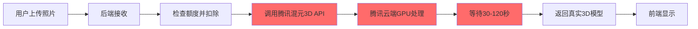
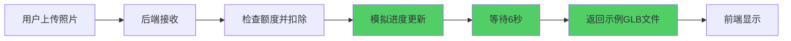

# Mock模式详解 - 开发测试指南

> **创建时间**：2026-04-18  
> **适用对象**：开发者、测试人员

---

## 📖 什么是Mock模式？

### **定义**

**Mock（模拟）** = 用简化的、伪造的实现替代真实的复杂功能

### **类比理解**

想象您在餐厅点餐：

| 场景 | 真实情况 | Mock模拟 |
|------|---------|---------|
| **点菜** | 厨师现做30分钟 | 服务员拿出预制菜模型 |
| **目的** | 吃到真实食物 | 确认菜品外观、价格、流程 |
| **优点** | 真实美味 | 快速、便宜、可重复 |
| **缺点** | 耗时、成本高 | 不是真菜，不能吃 |

---

## 🎯 为什么需要Mock模式？

### **问题场景**

假设您要开发一个"图片转3D模型"功能：

#### **没有Mock模式时**：
```
开发者每次测试都要：
1. 上传图片
2. 等待腾讯API处理（30-60秒）
3. 消耗10积分（约1元）
4. 需要稳定的网络
5. 如果API故障，无法测试

❌ 开发效率极低
❌ 测试成本高昂
❌ 依赖外部服务
```

#### **有Mock模式后**：
```
开发者测试时：
1. 上传图片
2. 等待6秒（模拟进度）
3. 不消耗积分
4. 无需网络
5. 随时可用

✅ 开发效率高
✅ 零成本测试
✅ 独立运行
```

---

## 🔄 Mock vs Cloud 模式对比

### **完整流程对比**

#### **Cloud模式（真实模式）**



**特点**：
- ✅ 生成**真实的3D模型**（根据图片内容）
- ✅ 高质量结果
- ❌ 需要腾讯云API密钥（SecretId + SecretKey）
- ❌ 每次调用扣费（10-20积分 ≈ 1-2元）
- ❌ 需要稳定网络连接
- ❌ 生成时间长（30-120秒）
- ❌ 依赖腾讯服务可用性

**代码实现**：
```python
async def _handle_cloud_generation(...):
    # 1. 扣除额度
    quota_service.deduct_quota(...)
    
    # 2. 保存图片
    save_image(image_path)
    
    # 3. 调用腾讯API ⚠️ 需要网络和密钥
    engine = get_hunyuan3d_cloud(version=api_version)
    result = await engine.generate(
        image_path=str(image_path),
        output_path=str(output_path)
    )
    
    # 4. 处理结果
    if result['success']:
        task_status['status'] = 'completed'
        task_status['glb_path'] = result['output_path']
    else:
        # 失败时退还额度
        quota_service.refund_quota(...)
```

---

#### **Mock模式（模拟模式）**



**特点**：
- ✅ **无需腾讯云API密钥**
- ✅ **无需网络连接**
- ✅ 快速完成（6秒）
- ✅ 不产生费用
- ✅ 可以测试完整的UI流程
- ✅ 额度管理正常工作
- ❌ 返回的是**固定示例模型**（不是根据图片生成的）
- ❌ 模型内容与上传的图片无关

**代码实现**：
```python
async def _handle_mock_generation(...):
    # 1. 扣除额度（与Cloud模式一致）
    quota_service.deduct_quota(...)
    
    # 2. 保存图片（仅用于记录）
    save_image(image_path)
    
    # 3. 模拟进度更新 ⚠️ 不调用腾讯API
    for progress in [10, 30, 50, 70, 90, 100]:
        await asyncio.sleep(1)  # 每秒更新一次
        task_status['progress'] = progress
        task_status['message'] = f'[Mock] 生成中... {progress}%'
    
    # 4. 使用示例GLB文件
    example_glb = Path('assets/example_model.glb')
    if example_glb.exists():
        shutil.copy2(example_glb, output_path)
    else:
        output_path.write_bytes(b'')  # 空文件作为占位符
    
    # 5. 标记完成
    task_status['status'] = 'completed'
    task_status['glb_path'] = str(output_path)
    
    # 6. 记录成功
    quota_service.record_generation_success(...)
```

---

## 📊 详细对比表

| 维度 | Mock模式 | Cloud模式 |
|------|---------|----------|
| **API调用** | ❌ 不调用 | ✅ 调用腾讯API |
| **网络要求** | ❌ 不需要 | ✅ 需要稳定网络 |
| **API密钥** | ❌ 不需要 | ✅ 需要SecretId/Key |
| **生成时间** | 6秒 | 30-120秒 |
| **费用** | 0元 | 1-2元/次 |
| **模型质量** | 固定示例 | 根据图片生成 |
| **模型内容** | 与图片无关 | 与图片相关 |
| **额度扣除** | ✅ 正常扣除 | ✅ 正常扣除 |
| **进度显示** | ✅ 模拟更新 | ✅ 真实进度 |
| **错误处理** | ✅ 完整实现 | ✅ 完整实现 |
| **适用场景** | 开发测试 | 生产环境 |

---

## 💻 如何切换模式？

### **通过 `.env` 配置文件**

```bash
# 项目根目录的 .env 文件

# ========== Mock模式（开发测试）==========
HUNYUAN3D_MODE=mock

# ========== Cloud模式（生产环境）==========
# HUNYUAN3D_MODE=cloud
# HUNYUAN3D_SECRET_ID=你的SecretId
# HUNYUAN3D_SECRET_KEY=你的SecretKey
```

**切换步骤**：
1. 编辑 `.env` 文件
2. 修改 `HUNYUAN3D_MODE` 的值
3. 重启后端服务

```bash
cd backend
python -m uvicorn app.main:app --reload
```

---

## 🎨 Mock模式的实际效果

### **用户体验**

当用户使用Mock模式时，看到的界面：

```
┌─────────────────────────────────────┐
│ 左侧面板                             │
│                                     │
│ 📤 上传图片                          │
│ [选择图片按钮]                       │
│                                     │
│ 🎯 选择模型版本                      │
│ [hy-3d-3.0 标准版 ▼]                │
│                                     │
│ 🚀 开始生成                          │
│                                     │
│ 进度条：████████░░ 80%              │
│ 状态：[Mock] 生成中... 80%          │
│                                     │
└─────────────────────────────────────┘

┌─────────────────────────────────────┐
│ 右侧面板 - 3D模型预览                │
│                                     │
│     🎲 3D模型正在加载...            │
│         (旋转动画)                   │
│                                     │
│  （6秒后显示示例模型）               │
│     ┌───────────┐                  │
│     │           │                  │
│     │  3D模型   │  ← 示例GLB       │
│     │           │                  │
│     └───────────┘                  │
│                                     │
│  [⬇️ 下载GLB]                      │
└─────────────────────────────────────┘
```

### **控制台日志**

```javascript
// 前端Console
[ProfessionalGeneration] Task submitted: hunyuan_cloud_abc123
[ProfessionalGeneration] Polling status...
[ProfessionalGeneration] Progress: 10%
[ProfessionalGeneration] Progress: 30%
[ProfessionalGeneration] Progress: 50%
[ProfessionalGeneration] Progress: 70%
[ProfessionalGeneration] Progress: 90%
[ProfessionalGeneration] Progress: 100%
[ProfessionalGeneration] Model generated successfully: http://localhost:8000/api/v1/experimental/download/hunyuan_cloud_abc123
[ModelPreview] Model loaded successfully
```

```python
# 后端日志
INFO: [EXPERIMENTAL] Hunyuan3D mode: mock
INFO: [EXPERIMENTAL] Mock mode: received image uploads/experimental/hunyuan_cloud_abc123_input.png
INFO: [EXPERIMENTAL] Deducted 10 points from user 1, remaining: 190
INFO: [EXPERIMENTAL] Mock generation completed: uploads/experimental/hunyuan_cloud_abc123_model.glb
```

---

## 📦 如何获取示例GLB文件？

### **方法1：从glTF-Sample-Models下载**

```bash
# 1. 访问仓库
https://github.com/KhronosGroup/glTF-Sample-Models

# 2. 选择一个模型（例如：DamagedHelmet）
https://github.com/KhronosGroup/glTF-Sample-Models/tree/master/2.0/DamagedHelmet

# 3. 下载 GLB 文件
# 点击 "DamagedHelmet.glb" → Download

# 4. 重命名并放置
mv DamagedHelmet.glb backend/assets/example_model.glb
```

### **方法2：从Poly Haven下载（推荐）**

```bash
# Poly Haven提供CC0许可的免费模型
https://polyhaven.com/models

# 选择一个模型，下载GLB格式
# 例如：https://polyhaven.com/a/rock_02

# 放置到项目
mv rock_02.glb backend/assets/example_model.glb
```

### **方法3：使用在线工具生成简单模型**

如果没有现成的GLB文件，可以使用：
- [Three.js Editor](https://threejs.org/editor/) - 创建简单几何体
- [Blender](https://www.blender.org/) - 专业3D建模软件

---

## 🧪 Mock模式的测试场景

### **适合测试的功能**

✅ **UI交互流程**
- 图片上传
- 模型版本选择
- 进度条显示
- 3D模型预览
- 下载功能

✅ **业务逻辑**
- 额度扣除
- 额度不足提示
- 任务状态管理
- 错误处理

✅ **前端组件**
- Canvas渲染
- OrbitControls交互
- 加载状态
- 错误提示

### **不适合测试的内容**

❌ **真实3D生成质量**
- Mock返回的是固定模型
- 无法验证图片到3D的转换效果

❌ **API性能**
- Mock是本地模拟
- 无法测试网络延迟和API响应时间

❌ **腾讯API集成**
- Mock不调用腾讯API
- 无法验证签名、认证等

---

## 🚀 从Mock切换到Cloud

### **准备工作**

1. **获取腾讯云API密钥**
   ```
   访问：https://console.cloud.tencent.com/cam/capi
   创建密钥：SecretId + SecretKey
   ```

2. **充值额度**
   ```
   访问：https://console.cloud.tencent.com/ai3d
   购买积分包（新用户赠送100积分）
   ```

3. **准备示例GLB（可选）**
   ```bash
   mkdir -p backend/assets
   # 放入一个GLB文件
   cp your_model.glb backend/assets/example_model.glb
   ```

### **修改配置**

编辑 `.env` 文件：
```bash
# 之前（Mock模式）
HUNYUAN3D_MODE=mock

# 改为（Cloud模式）
HUNYUAN3D_MODE=cloud
HUNYUAN3D_SECRET_ID=AKIDxxxxxxxxxxxxxxxxxxxx
HUNYUAN3D_SECRET_KEY=xxxxxxxxxxxxxxxxxxxx
```

### **重启服务**

```bash
cd backend
python -m uvicorn app.main:app --reload
```

### **验证切换**

查看后端日志：
```
INFO: [EXPERIMENTAL] Hunyuan3D mode: cloud
INFO: 创建Hunyuan3D云端服务实例，版本: rapid
```

---

## 💡 最佳实践建议

### **开发阶段**
```
使用Mock模式
✅ 快速迭代UI
✅ 测试业务流程
✅ 调试前端组件
✅ 零成本开发
```

### **测试阶段**
```
混合使用
✅ Mock模式：测试UI和流程
✅ Cloud模式：测试真实生成效果
```

### **生产环境**
```
使用Cloud模式
✅ 真实3D生成
✅ 高质量结果
✅ 按量付费
```

---

## ❓ 常见问题

### **Q1: Mock模式下，为什么每次生成的模型都一样？**

**A**: 因为Mock模式返回的是固定的示例GLB文件，不会根据上传的图片内容生成不同的模型。这是正常行为，目的是测试UI流程而非真实生成功能。

---

### **Q2: Mock模式会扣除额度吗？**

**A**: 会的！Mock模式也会扣除额度，这样可以完整测试额度管理功能。如果需要重置额度，可以修改数据库或使用管理后台。

---

### **Q3: 没有示例GLB文件怎么办？**

**A**: Mock模式会自动创建一个空的GLB文件作为占位符。虽然无法看到3D模型，但可以测试完整的流程。建议从Poly Haven下载一个免费的GLB文件放入 `backend/assets/` 目录。

---

### **Q4: 如何知道当前是Mock还是Cloud模式？**

**A**: 
1. 查看 `.env` 文件中的 `HUNYUAN3D_MODE` 配置
2. 查看后端启动日志：`[EXPERIMENTAL] Hunyuan3D mode: mock/cloud`
3. 查看生成时的状态消息：`[Mock] 生成中...` vs `云端GPU处理中...`

---

### **Q5: Mock模式可以用于演示给客户看吗？**

**A**: 可以！Mock模式可以完整展示UI流程和交互效果。但需要明确告知客户：
- 这是演示模式
- 实际产品会根据图片生成真实3D模型
- 生成时间会更长（30-120秒）
- 模型质量会更高

---

## 📝 总结

### **Mock模式的核心价值**

1. **开发效率** ⚡
   - 无需等待API响应
   - 快速验证UI设计
   - 即时反馈

2. **成本控制** 💰
   - 零API调用费用
   - 无限次测试
   - 降低开发成本

3. **独立性** 🔒
   - 不依赖外部服务
   - 离线可用
   - 稳定可靠

4. **完整性** ✅
   - 测试完整业务流程
   - 验证额度管理
   - 确保错误处理

### **何时使用Mock模式**

- ✅ 开发新功能时
- ✅ 调试UI问题时
- ✅ 编写自动化测试时
- ✅ 演示产品原型时
- ✅ 网络不稳定时

### **何时使用Cloud模式**

- ✅ 测试真实生成效果时
- ✅ 评估模型质量时
- ✅ 性能测试时
- ✅ 生产环境部署时
- ✅ 验收测试时

---

**Mock模式让开发更高效，Cloud模式让产品更真实！** 🎉
