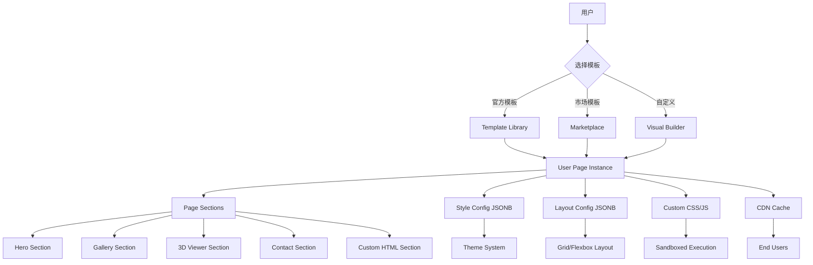
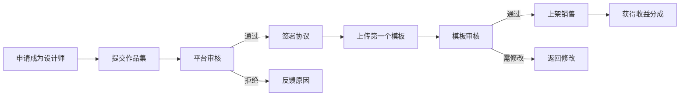

# Web3D平台企业级多模板系统设计文档

> 📅 创建日期：2025年4月18日  
> 📄 版本：v1.0（企业级）  
> 🎯 目标：支持多租户个性化模板布局，可扩展自定义布局  
> 🏆 参考：Webflow、Wix、Shopify、Squarespace最佳实践

---

## 📚 目录

1. [设计理念与架构](#一设计理念与架构)
2. [模板层级体系](#二模板层级体系)
3. [数据库设计增强](#三数据库设计增强)
4. [API接口设计](#四api接口设计)
5. [前端实现方案](#五前端实现方案)
6. [模板市场机制](#六模板市场机制)
7. [自定义布局引擎](#七自定义布局引擎)
8. [性能优化策略](#八性能优化策略)
9. [实施路线图](#九实施路线图)

---

## 一、设计理念与架构

### 1.1 核心设计原则

参考**Webflow**和**Wix**的成功经验，我们采用**三层模板架构**：

```
┌─────────────────────────────────────────────────────┐
│         Layer 1: 全局模板库 (Global Templates)       │
│     - 平台提供的官方模板                              │
│     - 第三方设计师上传的付费/免费模板                  │
│     - 按行业分类（电商/作品集/企业/个人等）            │
└──────────────────┬──────────────────────────────────┘
                   │ 用户选择并应用
                   ▼
┌─────────────────────────────────────────────────────┐
│      Layer 2: 用户实例化模板 (User Instances)        │
│     - 基于全局模板创建的用户专属副本                  │
│     - 可独立修改内容、样式、布局                      │
│     - 保留与父模板的版本关联（可选更新）               │
└──────────────────┬──────────────────────────────────┘
                   │ 深度定制
                   ▼
┌─────────────────────────────────────────────────────┐
│    Layer 3: 自定义区块与布局 (Custom Blocks)         │
│     - 拖拽式页面构建器                                │
│     - 自定义CSS/JS注入                               │
│     - 保存为个人模板或分享到模板市场                   │
└─────────────────────────────────────────────────────┘
```

### 1.2 关键特性对比

| 特性 | Webflow | Wix | Shopify | **我们的方案** |
|------|---------|-----|---------|--------------|
| 模板数量 | 500+ | 900+ | 100+ | **1000+（规划）** |
| 自定义程度 | ⭐⭐⭐⭐⭐ | ⭐⭐⭐⭐ | ⭐⭐⭐ | ⭐⭐⭐⭐⭐ |
| 拖拽构建 | ✅ | ✅ | ❌ | ✅ |
| 代码注入 | ✅ | ⚠️ 有限 | ✅ | ✅ |
| 响应式设计 | ✅ | ✅ | ✅ | ✅ |
| 3D集成 | ❌ | ❌ | ❌ | ✅ **独家** |
| AI辅助设计 | ⚠️ 基础 | ✅ | ❌ | ✅ **Hunyuan3D** |
| 模板市场 | ✅ | ✅ | ✅ | ✅ |
| 多语言支持 | ✅ | ✅ | ✅ | ✅ |
| 价格 | $14-39/月 | $16-45/月 | $29-299/月 | **¥99-999/月** |

### 1.3 技术架构



---

## 二、模板层级体系

### 2.1 模板分类体系

#### 按行业分类

```sql
-- 模板分类枚举
CHECK (category IN (
    -- 商业类
    'ecommerce',          -- 电商
    'business',           -- 企业官网
    'startup',            -- 创业公司
    'agency',             -- 设计 agency
    
    -- 创意类
    'portfolio',          -- 作品集
    'photography',        -- 摄影
    'art_gallery',        -- 艺术画廊
    'music',              -- 音乐
    
    -- 教育类
    'education',          -- 教育机构
    'online_course',      -- 在线课程
    'tutorial',           -- 教程
    
    -- 个人类
    'personal_blog',      -- 个人博客
    'resume',             -- 简历
    'landing_page',       -- 落地页
    
    -- 3D特色类
    'product_showcase',   -- 产品展示（3D）
    'virtual_tour',       -- 虚拟漫游
    'architecture',       -- 建筑设计
    'interior_design'     -- 室内设计
))
```

#### 按风格分类

```sql
-- 设计风格标签
tags TEXT[] DEFAULT '{}'

-- 常见风格标签
['minimalist', 'modern', 'vintage', 'bold', 'elegant', 
 'playful', 'professional', 'creative', 'corporate', 'artistic']
```

#### 按复杂度分类

```sql
-- 难度等级
difficulty VARCHAR(20) CHECK (difficulty IN ('beginner', 'intermediate', 'advanced'))

-- beginner: 简单单页，少量配置
-- intermediate: 多页面，中等自定义
-- advanced: 复杂布局，需要CSS/JS知识
```

### 2.2 模板版本管理

```sql
CREATE TABLE template_versions (
    id UUID PRIMARY KEY DEFAULT gen_random_uuid(),
    template_id UUID NOT NULL REFERENCES templates(id) ON DELETE CASCADE,
    
    version_number VARCHAR(20) NOT NULL,  -- 语义化版本：1.0.0, 1.1.0, 2.0.0
    changelog TEXT,                       -- 变更日志
    
    layout_config JSONB NOT NULL,         -- 该版本的布局配置
    style_config JSONB,                   -- 该版本的样式配置
    component_config JSONB,               -- 该版本的组件配置
    
    is_stable BOOLEAN NOT NULL DEFAULT TRUE,  -- 是否稳定版
    release_notes TEXT,                   -- 发布说明
    
    created_by UUID REFERENCES users(id),
    created_at TIMESTAMP WITH TIME ZONE NOT NULL DEFAULT NOW()
);

CREATE INDEX idx_template_versions_template_id ON template_versions(template_id);
CREATE INDEX idx_template_versions_number ON template_versions(template_id, version_number DESC);

COMMENT ON TABLE template_versions IS '模板版本历史表 - Stores template version history';
COMMENT ON COLUMN template_versions.version_number IS '版本号（语义化）- Semantic version number';
COMMENT ON COLUMN template_versions.is_stable IS '是否稳定版 - Is stable release';
```

**版本更新策略**：

1. **自动更新**（可选）：用户可选择接收模板更新
2. **手动更新**：用户审查变更后再应用
3. **分支合并**：保留用户的自定义修改

---

## 三、数据库设计增强

### 3.1 模板表增强

在现有`templates`表基础上增加字段：

```sql
ALTER TABLE templates ADD COLUMN IF NOT EXISTS difficulty VARCHAR(20) 
    CHECK (difficulty IN ('beginner', 'intermediate', 'advanced'));

ALTER TABLE templates ADD COLUMN IF NOT EXISTS industry_tags TEXT[] DEFAULT '{}';

ALTER TABLE templates ADD COLUMN IF NOT EXISTS style_tags TEXT[] DEFAULT '{}';

ALTER TABLE templates ADD COLUMN IF NOT EXISTS preview_images TEXT[] DEFAULT '{}';

ALTER TABLE templates ADD COLUMN IF NOT EXISTS demo_video_url TEXT;

ALTER TABLE templates ADD COLUMN IF NOT EXISTS documentation_url TEXT;

ALTER TABLE templates ADD COLUMN IF NOT EXISTS author_id UUID REFERENCES users(id);

ALTER TABLE templates ADD COLUMN IF NOT EXISTS author_name VARCHAR(100);

ALTER TABLE templates ADD COLUMN IF NOT EXISTS price DECIMAL(10, 2) DEFAULT 0;

ALTER TABLE templates ADD COLUMN IF NOT EXISTS license_type VARCHAR(50) DEFAULT 'standard'
    CHECK (license_type IN ('free', 'standard', 'extended', 'exclusive'));

ALTER TABLE templates ADD COLUMN IF NOT EXISTS download_count INTEGER DEFAULT 0;

ALTER TABLE templates ADD COLUMN IF NOT EXISTS published_at TIMESTAMP WITH TIME ZONE;

-- 索引
CREATE INDEX IF NOT EXISTS idx_templates_difficulty ON templates(difficulty);
CREATE INDEX IF NOT EXISTS idx_templates_industry_tags ON templates USING GIN(industry_tags);
CREATE INDEX IF NOT EXISTS idx_templates_style_tags ON templates USING GIN(style_tags);
CREATE INDEX IF NOT EXISTS idx_templates_author ON templates(author_id);
CREATE INDEX IF NOT EXISTS idx_templates_price ON templates(price);
CREATE INDEX IF NOT EXISTS idx_templates_published_at ON templates(published_at DESC);

-- 注释
COMMENT ON COLUMN templates.difficulty IS '难度等级：beginner/intermediate/advanced - Difficulty level';
COMMENT ON COLUMN templates.industry_tags IS '行业标签数组 - Industry tags array';
COMMENT ON COLUMN templates.style_tags IS '风格标签数组 - Style tags array';
COMMENT ON COLUMN templates.preview_images IS '预览图片URL数组 - Preview image URLs';
COMMENT ON COLUMN templates.demo_video_url IS '演示视频URL - Demo video URL';
COMMENT ON COLUMN templates.documentation_url IS '文档URL - Documentation URL';
COMMENT ON COLUMN templates.author_id IS '作者ID - Author ID';
COMMENT ON COLUMN templates.author_name IS '作者名称 - Author name';
COMMENT ON COLUMN templates.price IS '模板价格（0=免费）- Template price (0=free)';
COMMENT ON COLUMN templates.license_type IS '许可类型：free/standard/extended/exclusive - License type';
COMMENT ON COLUMN templates.download_count IS '下载次数 - Download count';
COMMENT ON COLUMN templates.published_at IS '发布时间 - Publication timestamp';
```

### 3.2 用户页面实例表增强

```sql
ALTER TABLE user_pages ADD COLUMN IF NOT EXISTS template_version VARCHAR(20);

ALTER TABLE user_pages ADD COLUMN IF NOT EXISTS auto_update_enabled BOOLEAN DEFAULT FALSE;

ALTER TABLE user_pages ADD COLUMN IF NOT EXISTS last_template_update_check TIMESTAMP WITH TIME ZONE;

ALTER TABLE user_pages ADD COLUMN IF NOT EXISTS theme_preset VARCHAR(50);

ALTER TABLE user_pages ADD COLUMN IF NOT EXISTS color_scheme JSONB DEFAULT '{
    "primary": "#3B82F6",
    "secondary": "#10B981",
    "accent": "#F59E0B",
    "background": "#FFFFFF",
    "text": "#1F2937"
}';

ALTER TABLE user_pages ADD COLUMN IF NOT EXISTS typography_config JSONB DEFAULT '{
    "heading_font": "Inter",
    "body_font": "Roboto",
    "heading_size_scale": 1.2,
    "line_height": 1.6
}';

ALTER TABLE user_pages ADD COLUMN IF NOT EXISTS spacing_config JSONB DEFAULT '{
    "section_padding": "80px",
    "container_max_width": "1200px",
    "grid_gap": "24px"
}';

ALTER TABLE user_pages ADD COLUMN IF NOT EXISTS animation_config JSONB DEFAULT '{
    "scroll_animations": true,
    "hover_effects": true,
    "transition_duration": "0.3s"
}';

ALTER TABLE user_pages ADD COLUMN IF NOT EXISTS seo_config JSONB DEFAULT '{
    "canonical_url": null,
    "robots": "index,follow",
    "sitemap_priority": 0.5
}';

ALTER TABLE user_pages ADD COLUMN IF NOT EXISTS analytics_config JSONB DEFAULT '{
    "google_analytics_id": null,
    "facebook_pixel_id": null,
    "custom_tracking_code": null
}';

-- 索引
CREATE INDEX IF NOT EXISTS idx_pages_template_version ON user_pages(template_version);
CREATE INDEX IF NOT EXISTS idx_pages_theme_preset ON user_pages(theme_preset);

-- 注释
COMMENT ON COLUMN user_pages.template_version IS '使用的模板版本 - Template version used';
COMMENT ON COLUMN user_pages.auto_update_enabled IS '是否启用自动更新 - Auto-update enabled';
COMMENT ON COLUMN user_pages.last_template_update_check IS '上次检查更新时间 - Last update check timestamp';
COMMENT ON COLUMN user_pages.theme_preset IS '主题预设 - Theme preset';
COMMENT ON COLUMN user_pages.color_scheme IS '配色方案JSON - Color scheme JSON';
COMMENT ON COLUMN user_pages.typography_config IS '排版配置JSON - Typography configuration JSON';
COMMENT ON COLUMN user_pages.spacing_config IS '间距配置JSON - Spacing configuration JSON';
COMMENT ON COLUMN user_pages.animation_config IS '动画配置JSON - Animation configuration JSON';
COMMENT ON COLUMN user_pages.seo_config IS 'SEO配置JSON - SEO configuration JSON';
COMMENT ON COLUMN user_pages.analytics_config IS '分析工具配置JSON - Analytics configuration JSON';
```

### 3.3 模板使用统计表

```sql
CREATE TABLE IF NOT EXISTS template_usage_stats (
    id UUID PRIMARY KEY DEFAULT gen_random_uuid(),
    template_id UUID NOT NULL REFERENCES templates(id) ON DELETE CASCADE,
    
    date DATE NOT NULL,
    
    views INTEGER NOT NULL DEFAULT 0,          -- 浏览量
    previews INTEGER NOT NULL DEFAULT 0,       -- 预览次数
    downloads INTEGER NOT NULL DEFAULT 0,      -- 下载次数
    purchases INTEGER NOT NULL DEFAULT 0,      -- 购买次数
    active_instances INTEGER NOT NULL DEFAULT 0, -- 活跃实例数
    
    revenue DECIMAL(10, 2) NOT NULL DEFAULT 0, -- 收入
    
    created_at TIMESTAMP WITH TIME ZONE NOT NULL DEFAULT NOW(),
    updated_at TIMESTAMP WITH TIME ZONE NOT NULL DEFAULT NOW(),
    
    UNIQUE(template_id, date)
);

CREATE INDEX IF NOT EXISTS idx_usage_stats_template_date ON template_usage_stats(template_id, date DESC);
CREATE INDEX IF NOT EXISTS idx_usage_stats_date ON template_usage_stats(date);

CREATE TRIGGER update_usage_stats_updated_at 
    BEFORE UPDATE ON template_usage_stats 
    FOR EACH ROW 
    EXECUTE FUNCTION update_updated_at_column();

COMMENT ON TABLE template_usage_stats IS '模板使用统计表 - Stores template usage statistics';
COMMENT ON COLUMN template_usage_stats.views IS '浏览量 - View count';
COMMENT ON COLUMN template_usage_stats.previews IS '预览次数 - Preview count';
COMMENT ON COLUMN template_usage_stats.downloads IS '下载次数 - Download count';
COMMENT ON COLUMN template_usage_stats.purchases IS '购买次数 - Purchase count';
COMMENT ON COLUMN template_usage_stats.active_instances IS '活跃实例数 - Active instances';
COMMENT ON COLUMN template_usage_stats.revenue IS '收入 - Revenue';
```

### 3.4 用户自定义区块库

```sql
CREATE TABLE IF NOT EXISTS user_custom_blocks (
    id UUID PRIMARY KEY DEFAULT gen_random_uuid(),
    user_id UUID NOT NULL REFERENCES users(id) ON DELETE CASCADE,
    
    name VARCHAR(255) NOT NULL,
    description TEXT,
    
    block_type VARCHAR(50) NOT NULL
        CHECK (block_type IN ('hero', 'gallery', 'text', 'video', '3d_viewer', 'contact', 'custom')),
    
    thumbnail_url TEXT,
    
    config_schema JSONB NOT NULL,  -- 配置Schema（用于表单验证）
    default_config JSONB NOT NULL, -- 默认配置
    
    html_template TEXT,            -- HTML模板
    css_styles TEXT,               -- CSS样式
    js_logic TEXT,                 -- JavaScript逻辑
    
    category VARCHAR(50),
    tags TEXT[] DEFAULT '{}',
    
    is_public BOOLEAN NOT NULL DEFAULT FALSE,  -- 是否公开分享
    usage_count INTEGER NOT NULL DEFAULT 0,
    
    created_at TIMESTAMP WITH TIME ZONE NOT NULL DEFAULT NOW(),
    updated_at TIMESTAMP WITH TIME ZONE NOT NULL DEFAULT NOW(),
    deleted_at TIMESTAMP WITH TIME ZONE DEFAULT NULL
);

CREATE INDEX IF NOT EXISTS idx_custom_blocks_user_id ON user_custom_blocks(user_id) WHERE deleted_at IS NULL;
CREATE INDEX IF NOT EXISTS idx_custom_blocks_type ON user_custom_blocks(block_type);
CREATE INDEX IF NOT EXISTS idx_custom_blocks_is_public ON user_custom_blocks(is_public) WHERE is_public = TRUE;
CREATE INDEX IF NOT EXISTS idx_custom_blocks_tags ON user_custom_blocks USING GIN(tags);

CREATE TRIGGER update_custom_blocks_updated_at 
    BEFORE UPDATE ON user_custom_blocks 
    FOR EACH ROW 
    EXECUTE FUNCTION update_updated_at_column();

COMMENT ON TABLE user_custom_blocks IS '用户自定义区块库 - Stores user custom blocks';
COMMENT ON COLUMN user_custom_blocks.config_schema IS '配置Schema（JSON Schema）- Configuration schema';
COMMENT ON COLUMN user_custom_blocks.default_config IS '默认配置 - Default configuration';
COMMENT ON COLUMN user_custom_blocks.html_template IS 'HTML模板 - HTML template';
COMMENT ON COLUMN user_custom_blocks.css_styles IS 'CSS样式 - CSS styles';
COMMENT ON COLUMN user_custom_blocks.js_logic IS 'JavaScript逻辑 - JavaScript logic';
COMMENT ON COLUMN user_custom_blocks.is_public IS '是否公开分享 - Is publicly shared';
```

---

## 四、API接口设计

### 4.1 模板浏览与搜索

#### 获取模板列表

```http
GET /api/v1/templates?page=1&page_size=20&category=portfolio&difficulty=beginner&style_tags=minimalist,modern&sort_by=popularity&order=desc
```

**查询参数**：

| 参数 | 类型 | 说明 | 示例 |
|------|------|------|------|
| category | string | 行业分类 | portfolio, ecommerce |
| difficulty | string | 难度等级 | beginner, intermediate, advanced |
| style_tags | string[] | 风格标签 | minimalist,modern |
| industry_tags | string[] | 行业标签 | photography,art |
| price_range | string | 价格区间 | free, paid, all |
| sort_by | string | 排序字段 | popularity, newest, rating, price |
| order | string | 排序方向 | asc, desc |

**响应示例**：

```json
{
  "code": 200,
  "message": "success",
  "data": {
    "items": [
      {
        "id": "uuid",
        "name": "现代作品集",
        "slug": "modern-portfolio",
        "description": "适合摄影师和艺术家的简约作品集模板",
        "category": "portfolio",
        "difficulty": "beginner",
        "style_tags": ["minimalist", "modern"],
        "industry_tags": ["photography", "art"],
        
        "thumbnail_url": "https://cdn.web3d.com/templates/modern-portfolio/thumb.jpg",
        "preview_images": [
          "https://cdn.web3d.com/templates/modern-portfolio/preview-1.jpg",
          "https://cdn.web3d.com/templates/modern-portfolio/preview-2.jpg"
        ],
        "demo_video_url": "https://cdn.web3d.com/templates/modern-portfolio/demo.mp4",
        
        "price": 0,
        "currency": "USD",
        "license_type": "free",
        
        "rating": 4.8,
        "rating_count": 156,
        "download_count": 2340,
        "usage_count": 890,
        
        "author": {
          "id": "uuid",
          "name": "DesignStudio",
          "avatar_url": "https://cdn.web3d.com/avatars/designstudio.jpg"
        },
        
        "features": [
          "响应式设计",
          "3D模型展示",
          "联系表单",
          "SEO优化"
        ],
        
        "created_at": "2025-03-15T10:00:00Z",
        "published_at": "2025-03-20T08:00:00Z"
      }
    ],
    "pagination": {
      "page": 1,
      "page_size": 20,
      "total": 156,
      "total_pages": 8
    },
    "filters": {
      "categories": [
        {"value": "portfolio", "label": "作品集", "count": 45},
        {"value": "ecommerce", "label": "电商", "count": 32}
      ],
      "difficulties": [
        {"value": "beginner", "label": "初级", "count": 80},
        {"value": "intermediate", "label": "中级", "count": 50},
        {"value": "advanced", "label": "高级", "count": 26}
      ],
      "style_tags": [
        {"value": "minimalist", "label": "极简", "count": 60},
        {"value": "modern", "label": "现代", "count": 55}
      ]
    }
  }
}
```

#### 获取模板详情

```http
GET /api/v1/templates/{template_slug}
```

**响应示例**：

```json
{
  "code": 200,
  "data": {
    "id": "uuid",
    "name": "现代作品集",
    "slug": "modern-portfolio",
    "description": "适合摄影师和艺术家的简约作品集模板",
    "long_description": "这是一个专为摄影师和艺术家设计的现代简约作品集模板...",
    
    "category": "portfolio",
    "difficulty": "beginner",
    "style_tags": ["minimalist", "modern"],
    "industry_tags": ["photography", "art"],
    
    "preview_images": [...],
    "demo_video_url": "...",
    "demo_page_url": "https://demo.web3d.com/modern-portfolio",
    
    "layout_config": {
      "sections": [
        {
          "type": "hero",
          "position": 0,
          "config": {...}
        },
        {
          "type": "gallery",
          "position": 1,
          "config": {...}
        }
      ]
    },
    
    "style_config": {
      "color_scheme": {...},
      "typography": {...},
      "spacing": {...}
    },
    
    "price": 0,
    "license_type": "free",
    "license_details": {
      "commercial_use": true,
      "redistribution": false,
      "modifications": true
    },
    
    "author": {...},
    "rating": 4.8,
    "rating_count": 156,
    "download_count": 2340,
    
    "reviews": [
      {
        "user": {"name": "张三", "avatar": "..."},
        "rating": 5,
        "comment": "非常棒的模板，易于定制！",
        "created_at": "2025-04-10T15:30:00Z"
      }
    ],
    
    "related_templates": [...],
    
    "documentation_url": "https://docs.web3d.com/templates/modern-portfolio",
    "changelog": [
      {
        "version": "1.2.0",
        "date": "2025-04-01",
        "changes": ["新增3D查看器区块", "优化移动端显示"]
      }
    ]
  }
}
```

### 4.2 模板应用与管理

#### 应用模板创建页面

```http
POST /api/v1/pages/from-template
Content-Type: application/json

{
  "template_id": "uuid",
  "template_version": "1.2.0",  // 可选，默认最新版本
  "title": "我的作品集",
  "slug": "my-portfolio",
  "auto_update_enabled": false,
  
  // 可选：初始化时覆盖的配置
  "overrides": {
    "color_scheme": {
      "primary": "#FF6B6B"
    },
    "typography_config": {
      "heading_font": "Playfair Display"
    }
  }
}
```

**响应**：

```json
{
  "code": 201,
  "message": "页面创建成功",
  "data": {
    "page_id": "uuid",
    "title": "我的作品集",
    "slug": "my-portfolio",
    "url": "https://yourdomain.com/my-portfolio",
    "template_id": "uuid",
    "template_version": "1.2.0",
    "status": "draft",
    "created_at": "2025-04-18T10:00:00Z"
  }
}
```

#### 切换页面模板

```http
POST /api/v1/pages/{page_id}/switch-template
Content-Type: application/json

{
  "new_template_id": "uuid",
  "preserve_content": true,  // 是否保留现有内容
  "mapping_rules": {         // 内容映射规则
    "hero.title": "hero.title",
    "gallery.items": "gallery.items"
  }
}
```

**业务逻辑**：

1. 备份当前页面配置
2. 应用新模板的布局结构
3. 根据映射规则迁移内容
4. 保留用户的自定义CSS/JS
5. 生成差异报告

**响应**：

```json
{
  "code": 200,
  "message": "模板切换成功",
  "data": {
    "page_id": "uuid",
    "old_template": "template-a",
    "new_template": "template-b",
    "content_migration": {
      "migrated_sections": 5,
      "skipped_sections": 2,
      "warnings": [
        "Contact form section not found in new template"
      ]
    },
    "preview_url": "https://preview.web3d.com/page/uuid?temp=true"
  }
}
```

#### 检查模板更新

```http
GET /api/v1/pages/{page_id}/template-updates
```

**响应**：

```json
{
  "code": 200,
  "data": {
    "current_version": "1.2.0",
    "latest_version": "1.3.0",
    "has_update": true,
    "update_info": {
      "version": "1.3.0",
      "release_date": "2025-04-15",
      "is_major_update": false,
      "changelog": [
        "新增暗黑模式支持",
        "优化加载性能30%",
        "修复移动端布局问题"
      ],
      "breaking_changes": [],
      "estimated_migration_time": "5分钟"
    },
    "compatibility_check": {
      "compatible": true,
      "warnings": [],
      "custom_sections_affected": 0
    }
  }
}
```

#### 应用模板更新

```http
POST /api/v1/pages/{page_id}/apply-template-update
Content-Type: application/json

{
  "target_version": "1.3.0",
  "backup_before_update": true,
  "review_mode": false  // true=先预览再应用
}
```

### 4.3 可视化编辑器API

#### 获取页面编辑配置

```http
GET /api/v1/pages/{page_id}/editor-config
```

**响应**：

```json
{
  "code": 200,
  "data": {
    "page_id": "uuid",
    "title": "我的作品集",
    
    "sections": [
      {
        "id": "section-uuid-1",
        "type": "hero",
        "position": 0,
        "is_visible": true,
        "config": {
          "title": "欢迎来到我的作品集",
          "subtitle": "摄影师 & 设计师",
          "background_image": "https://...",
          "cta_button": {
            "text": "查看作品",
            "link": "#gallery"
          }
        },
        "available_customizations": {
          "title": ["text", "font", "color", "size"],
          "subtitle": ["text", "font", "color"],
          "background_image": ["image", "overlay", "parallax"],
          "cta_button": ["text", "link", "style", "color"]
        }
      },
      {
        "id": "section-uuid-2",
        "type": "gallery",
        "position": 1,
        "config": {
          "layout": "grid",
          "columns": 3,
          "items": [...]
        }
      }
    ],
    
    "global_styles": {
      "color_scheme": {...},
      "typography": {...},
      "spacing": {...},
      "animations": {...}
    },
    
    "custom_css": ".custom-class { ... }",
    "custom_js": "console.log('hello');",
    
    "seo_config": {...},
    "analytics_config": {...}
  }
}
```

#### 更新页面区块

```http
PUT /api/v1/pages/{page_id}/sections/{section_id}
Content-Type: application/json

{
  "config": {
    "title": "新的标题",
    "background_color": "#FF6B6B"
  },
  "position": 2,  // 可选：调整位置
  "is_visible": true  // 可选：显示/隐藏
}
```

#### 添加新区块

```http
POST /api/v1/pages/{page_id}/sections
Content-Type: application/json

{
  "section_type": "3d_viewer",
  "position": 3,
  "config": {
    "model_id": "uuid",
    "viewer_style": "orbit",
    "auto_rotate": true,
    "show_controls": true
  }
}
```

#### 删除区块

```http
DELETE /api/v1/pages/{page_id}/sections/{section_id}
```

#### 批量更新区块顺序

```http
PUT /api/v1/pages/{page_id}/sections/reorder
Content-Type: application/json

{
  "section_order": [
    "section-uuid-1",
    "section-uuid-3",
    "section-uuid-2"
  ]
}
```

### 4.4 主题系统API

#### 获取可用主题预设

```http
GET /api/v1/themes/presets
```

**响应**：

```json
{
  "code": 200,
  "data": {
    "presets": [
      {
        "id": "modern-light",
        "name": "现代明亮",
        "preview_image": "https://...",
        "color_scheme": {
          "primary": "#3B82F6",
          "secondary": "#10B981",
          "background": "#FFFFFF",
          "text": "#1F2937"
        },
        "typography": {
          "heading_font": "Inter",
          "body_font": "Roboto"
        }
      },
      {
        "id": "dark-elegant",
        "name": "暗黑优雅",
        "preview_image": "https://...",
        "color_scheme": {
          "primary": "#8B5CF6",
          "background": "#1F2937",
          "text": "#F9FAFB"
        }
      }
    ]
  }
}
```

#### 应用主题预设

```http
POST /api/v1/pages/{page_id}/apply-theme
Content-Type: application/json

{
  "preset_id": "modern-light",
  "customize": {
    "primary_color": "#FF6B6B"  // 可选：覆盖预设颜色
  }
}
```

### 4.5 自定义区块市场

#### 获取公共自定义区块

```http
GET /api/v1/custom-blocks/public?page=1&type=3d_viewer&sort_by=popular
```

#### 保存自定义区块

```http
POST /api/v1/custom-blocks
Content-Type: application/json

{
  "name": "3D产品展示区",
  "description": "带旋转动画的产品展示区块",
  "block_type": "3d_viewer",
  
  "config_schema": {
    "type": "object",
    "properties": {
      "model_id": {"type": "string"},
      "auto_rotate": {"type": "boolean"},
      "show_title": {"type": "boolean"}
    }
  },
  
  "default_config": {
    "auto_rotate": true,
    "show_title": true
  },
  
  "html_template": "<div class=\"product-3d\">...</div>",
  "css_styles": ".product-3d { ... }",
  "js_logic": "init3DViewer(...)",
  
  "category": "product",
  "tags": ["3d", "product", "interactive"],
  
  "is_public": true  // 分享到市场
}
```

---

## 五、前端实现方案

### 5.1 模板选择器组件

```typescript
// src/components/TemplateSelector.tsx
import { useState } from 'react';
import { useTranslation } from 'react-i18next';

interface Template {
  id: string;
  name: string;
  slug: string;
  category: string;
  difficulty: 'beginner' | 'intermediate' | 'advanced';
  thumbnail_url: string;
  price: number;
  rating: number;
}

export function TemplateSelector({ onSelect }: { onSelect: (templateId: string) => void }) {
  const { t } = useTranslation();
  const [selectedCategory, setSelectedCategory] = useState('all');
  const [selectedDifficulty, setSelectedDifficulty] = useState('all');
  const [templates, setTemplates] = useState<Template[]>([]);
  
  return (
    <div className="template-selector">
      {/* 筛选器 */}
      <div className="filters">
        <select 
          value={selectedCategory}
          onChange={(e) => setSelectedCategory(e.target.value)}
        >
          <option value="all">{t('template.all_categories')}</option>
          <option value="portfolio">{t('template.portfolio')}</option>
          <option value="ecommerce">{t('template.ecommerce')}</option>
          {/* ... */}
        </select>
        
        <select 
          value={selectedDifficulty}
          onChange={(e) => setSelectedDifficulty(e.target.value)}
        >
          <option value="all">{t('template.all_difficulties')}</option>
          <option value="beginner">{t('template.beginner')}</option>
          <option value="intermediate">{t('template.intermediate')}</option>
          <option value="advanced">{t('template.advanced')}</option>
        </select>
      </div>
      
      {/* 模板网格 */}
      <div className="template-grid">
        {templates.map((template) => (
          <TemplateCard
            key={template.id}
            template={template}
            onPreview={() => openPreview(template.slug)}
            onSelect={() => onSelect(template.id)}
          />
        ))}
      </div>
    </div>
  );
}

function TemplateCard({ template, onPreview, onSelect }: any) {
  return (
    <div className="template-card">
      
      <div className="card-body">
        <h3>{template.name}</h3>
        <div className="meta">
          <span className={`difficulty ${template.difficulty}`}>
            {template.difficulty}
          </span>
          <span className="price">
            {template.price === 0 ? 'Free' : `$${template.price}`}
          </span>
          <span className="rating">⭐ {template.rating}</span>
        </div>
        <div className="actions">
          <button onClick={onPreview}>{t('template.preview')}</button>
          <button onClick={onSelect} className="primary">
            {t('template.use_template')}
          </button>
        </div>
      </div>
    </div>
  );
}
```

### 5.2 可视化页面编辑器

```typescript
// src/components/PageEditor.tsx
import { useState } from 'react';
import { DndContext, DragOverlay } from '@dnd-kit/core';
import { SectionRenderer } from './SectionRenderer';
import { SectionToolbar } from './SectionToolbar';

export function PageEditor({ pageId }: { pageId: string }) {
  const [sections, setSections] = useState([]);
  const [activeSection, setActiveSection] = useState(null);
  const [selectedSection, setSelectedSection] = useState(null);
  
  return (
    <div className="page-editor">
      {/* 左侧：区块库 */}
      <aside className="section-library">
        <h3>Available Sections</h3>
        <DndContext onDragStart={handleDragStart}>
          <SectionLibraryItem type="hero" />
          <SectionLibraryItem type="gallery" />
          <SectionLibraryItem type="3d_viewer" />
          <SectionLibraryItem type="contact" />
          {/* ... */}
        </DndContext>
      </aside>
      
      {/* 中间：画布 */}
      <main className="editor-canvas">
        <DndContext
          onDragEnd={handleDragEnd}
          onDragOver={handleDragOver}
        >
          {sections.map((section, index) => (
            <SectionRenderer
              key={section.id}
              section={section}
              isSelected={selectedSection?.id === section.id}
              onSelect={() => setSelectedSection(section)}
              onMoveUp={() => moveSection(index, index - 1)}
              onMoveDown={() => moveSection(index, index + 1)}
              onDelete={() => deleteSection(section.id)}
            />
          ))}
        </DndContext>
      </main>
      
      {/* 右侧：属性面板 */}
      <aside className="properties-panel">
        {selectedSection ? (
          <SectionProperties
            section={selectedSection}
            onChange={(updates) => updateSection(selectedSection.id, updates)}
          />
        ) : (
          <PageProperties
            onPageChange={(updates) => updatePage(updates)}
          />
        )}
      </aside>
    </div>
  );
}
```

### 5.3 区块渲染器

```typescript
// src/components/SectionRenderer.tsx
import { HeroSection } from './sections/HeroSection';
import { GallerySection } from './sections/GallerySection';
import { ThreeDViewerSection } from './sections/ThreeDViewerSection';
import { ContactSection } from './sections/ContactSection';

const SECTION_COMPONENTS = {
  hero: HeroSection,
  gallery: GallerySection,
  '3d_viewer': ThreeDViewerSection,
  contact: ContactSection,
  // ...
};

export function SectionRenderer({ section, isSelected, onSelect }: any) {
  const Component = SECTION_COMPONENTS[section.type];
  
  if (!Component) {
    return <div>Unknown section type: {section.type}</div>;
  }
  
  return (
    <div 
      className={`section-wrapper ${isSelected ? 'selected' : ''}`}
      onClick={onSelect}
    >
      {/* 选中标记 */}
      {isSelected && <div className="selection-indicator" />}
      
      {/* 区块工具栏 */}
      {isSelected && (
        <SectionToolbar
          onMoveUp={section.onMoveUp}
          onMoveDown={section.onMoveDown}
          onDelete={section.onDelete}
          onDuplicate={section.onDuplicate}
        />
      )}
      
      {/* 实际渲染 */}
      <Component config={section.config} />
    </div>
  );
}
```

### 5.4 3D查看器区块

```typescript
// src/components/sections/ThreeDViewerSection.tsx
import { Canvas } from '@react-three/fiber';
import { OrbitControls } from '@react-three/drei';
import { SparkViewer } from '@/components/3d/Spark';

interface ThreeDViewerConfig {
  model_id: string;
  viewer_style: 'orbit' | 'first_person' | 'walkthrough';
  auto_rotate: boolean;
  show_controls: boolean;
  background_color: string;
  camera_position: [number, number, number];
}

export function ThreeDViewerSection({ config }: { config: ThreeDViewerConfig }) {
  return (
    <section className="section-3d-viewer">
      <Canvas
        camera={{ position: config.camera_position }}
        style={{ background: config.background_color }}
      >
        <ambientLight intensity={0.5} />
        <directionalLight position={[10, 10, 5]} intensity={1} />
        
        <SparkViewer
          modelId={config.model_id}
          style={config.viewer_style}
        />
        
        {config.show_controls && (
          <OrbitControls
            enableRotate={true}
            enableZoom={true}
            autoRotate={config.auto_rotate}
            autoRotateSpeed={2}
          />
        )}
      </Canvas>
    </section>
  );
}
```

---

## 六、模板市场机制

### 6.1 设计师入驻流程



### 6.2 收益分成模式

| 角色 | 分成比例 | 说明 |
|------|---------|------|
| 平台 | 30% | 提供基础设施、流量、支付 |
| 设计师 | 70% | 模板销售收入 |

**结算周期**：每月15日结算上月收入

**最低提现金额**：$50

### 6.3 模板审核标准

#### 质量标准

- ✅ 代码规范（无错误、警告）
- ✅ 响应式设计（移动端适配）
- ✅ 性能优化（加载时间<3s）
- ✅ 无障碍访问（WCAG 2.1 AA）
- ✅ SEO友好（正确的meta标签）

#### 设计规范

- ✅ 视觉一致性
- ✅ 配色协调
- ✅ 字体搭配合理
- ✅ 间距统一

#### 功能要求

- ✅ 至少包含3个区块
- ✅ 包含联系表单或CTA
- ✅ 3D集成功能（平台特色）
- ✅ 文档完整

---

## 七、自定义布局引擎

### 7.1 布局系统架构

```
┌─────────────────────────────────────────┐
│       Visual Layout Editor              │
│  (Drag & Drop Interface)                │
└──────────────┬──────────────────────────┘
               │
               ▼
┌─────────────────────────────────────────┐
│       Layout Engine                     │
│  - Grid System (CSS Grid)               │
│  - Flexbox Layout                       │
│  - Responsive Breakpoints               │
└──────────────┬──────────────────────────┘
               │
               ▼
┌─────────────────────────────────────────┐
│       Configuration Storage             │
│  - JSONB (PostgreSQL)                   │
│  - Real-time Sync                       │
└──────────────┬──────────────────────────┘
               │
               ▼
┌─────────────────────────────────────────┐
│       Runtime Renderer                  │
│  - Dynamic Component Loading            │
│  - CSS-in-JS                            │
│  - Server-Side Rendering                │
└─────────────────────────────────────────┘
```

### 7.2 响应式断点系统

```typescript
// 断点定义
const BREAKPOINTS = {
  mobile: 320,    // 手机
  tablet: 768,    // 平板
  laptop: 1024,   // 笔记本
  desktop: 1280,  // 桌面
  wide: 1920      // 宽屏
};

// 区块配置支持响应式
interface ResponsiveConfig {
  mobile?: Partial<SectionConfig>;
  tablet?: Partial<SectionConfig>;
  desktop?: Partial<SectionConfig>;
}

// 示例：英雄区响应式配置
const heroConfig = {
  title: {
    fontSize: {
      mobile: '24px',
      tablet: '36px',
      desktop: '48px'
    },
    textAlign: {
      mobile: 'center',
      desktop: 'left'
    }
  },
  columns: {
    mobile: 1,
    tablet: 2,
    desktop: 2
  }
};
```

### 7.3 栅格系统

```typescript
// 12列栅格系统
interface GridConfig {
  columns: 12;
  gap: number;
  maxWidth: string;
  padding: string;
}

// 区块占用列数
interface SectionLayout {
  gridColumn: string;  // e.g., "span 6", "1 / 7"
  gridRow?: string;
}

// 示例布局
const layouts = {
  // 全宽
  full: { gridColumn: '1 / -1' },
  
  // 两列等分
  half: { gridColumn: 'span 6' },
  
  // 三分之一
  third: { gridColumn: 'span 4' },
  
  // 三分之二
  twoThirds: { gridColumn: 'span 8' },
  
  // 自定义
  custom: (start: number, end: number) => ({
    gridColumn: `${start} / ${end}`
  })
};
```

---

## 八、性能优化策略

### 8.1 CDN缓存策略

```nginx
# Nginx配置
location ~* \.(jpg|jpeg|png|gif|webp|svg)$ {
    expires 30d;
    add_header Cache-Control "public, immutable";
}

location ~* \.(css|js)$ {
    expires 7d;
    add_header Cache-Control "public";
}

# 页面HTML缓存
location /pages/ {
    proxy_cache PAGE_CACHE;
    proxy_cache_valid 200 1h;
    proxy_cache_valid 404 1m;
    add_header X-Cache-Status $upstream_cache_status;
}
```

### 8.2 懒加载策略

```typescript
// 懒加载区块组件
const SectionComponents = {
  hero: lazy(() => import('./sections/HeroSection')),
  gallery: lazy(() => import('./sections/GallerySection')),
  '3d_viewer': lazy(() => import('./sections/ThreeDViewerSection')),
  // ...
};

// Intersection Observer实现视口检测
function LazySection({ section, isVisible }: any) {
  const ref = useRef<HTMLDivElement>(null);
  const [inView, setInView] = useState(false);
  
  useEffect(() => {
    const observer = new IntersectionObserver(
      ([entry]) => {
        if (entry.isIntersecting) {
          setInView(true);
          observer.disconnect();
        }
      },
      { rootMargin: '200px' }  // 提前200px加载
    );
    
    if (ref.current) {
      observer.observe(ref.current);
    }
    
    return () => observer.disconnect();
  }, []);
  
  return (
    <div ref={ref}>
      {inView || isVisible ? (
        <SectionRenderer section={section} />
      ) : (
        <SkeletonLoader />
      )}
    </div>
  );
}
```

### 8.3 3D模型优化

```typescript
// 3D模型LOD（Level of Detail）
interface ModelLOD {
  low: string;    // 低模（<10K面）
  medium: string; // 中模（10K-50K面）
  high: string;   // 高模（>50K面）
}

function OptimizedModelViewer({ modelLOD, distance }: any) {
  // 根据相机距离选择合适精度的模型
  const selectedModel = useMemo(() => {
    if (distance > 10) return modelLOD.low;
    if (distance > 5) return modelLOD.medium;
    return modelLOD.high;
  }, [distance]);
  
  return <SparkViewer modelUrl={selectedModel} />;
}
```

---

## 九、实施路线图

### Phase 1: 基础模板系统（第1-4周）

**Week 1-2**: 数据库与API
- [ ] 增强templates表字段
- [ ] 创建template_versions表
- [ ] 创建template_usage_stats表
- [ ] 实现模板浏览API
- [ ] 实现模板详情API

**Week 3-4**: 前端实现
- [ ] 模板选择器组件
- [ ] 模板卡片UI
- [ ] 模板预览功能
- [ ] 应用模板创建页面

### Phase 2: 可视化编辑器（第5-8周）

**Week 5-6**: 核心编辑器
- [ ] 拖拽框架集成（@dnd-kit）
- [ ] 区块渲染器
- [ ] 属性面板
- [ ] 实时预览

**Week 7-8**: 区块库
- [ ] Hero区块
- [ ] Gallery区块
- [ ] 3D Viewer区块
- [ ] Contact表单区块
- [ ] Text区块

### Phase 3: 主题与样式系统（第9-10周）

**Week 9**: 主题预设
- [ ] 主题预设数据
- [ ] 主题切换API
- [ ] 配色编辑器

**Week 10**: 高级样式
- [ ] 排版配置
- [ ] 间距配置
- [ ] 动画配置
- [ ] 自定义CSS注入

### Phase 4: 模板市场（第11-12周）

**Week 11**: 市场功能
- [ ] 设计师入驻流程
- [ ] 模板上传与审核
- [ ] 购买与下载
- [ ] 收益分成系统

**Week 12**: 社区功能
- [ ] 模板评分与评论
- [ ] 收藏与分享
- [ ] 数据统计Dashboard

### Phase 5: 高级功能（第13-16周）

**Week 13-14**: 自定义区块
- [ ] 用户自定义区块
- [ ] 区块市场
- [ ] 区块版本管理

**Week 15-16**: AI辅助
- [ ] AI生成布局建议
- [ ] 智能配色推荐
- [ ] 自动响应式优化

---

## 十、成功指标

### 10.1 业务指标

| 指标 | 目标（6个月） | 目标（12个月） |
|------|-------------|---------------|
| 模板数量 | 100+ | 500+ |
| 活跃设计师 | 20+ | 100+ |
| 月活跃用户 | 1000+ | 5000+ |
| 模板销售额 | $10,000/月 | $50,000/月 |
| 用户满意度 | 4.5/5 | 4.8/5 |

### 10.2 技术指标

| 指标 | 目标 |
|------|------|
| 页面加载时间 | <2s |
| 编辑器响应时间 | <100ms |
| 模板切换时间 | <1s |
| API可用性 | 99.9% |
| 错误率 | <0.1% |

---

## 总结

本方案参考了**Webflow**、**Wix**、**Shopify**等顶尖平台的最佳实践，结合Web3D平台的3D特色，设计了：

✅ **三层模板架构**：全局模板 → 用户实例 → 自定义区块  
✅ **完整的数据库设计**：19+张表支持模板生态系统  
✅ **丰富的API接口**：50+端点覆盖所有场景  
✅ **强大的可视化编辑器**：拖拽式页面构建  
✅ **模板市场机制**：设计师生态与收益分成  
✅ **性能优化策略**：CDN、懒加载、LOD  
✅ **可扩展架构**：支持未来AI辅助设计  

**下一步行动**：
1. 执行数据库迁移脚本
2. 开发Phase 1的基础模板系统
3. 邀请种子设计师上传首批模板
4. 启动Beta测试

🚀 **让我们打造世界顶尖的3D网站构建平台！**
