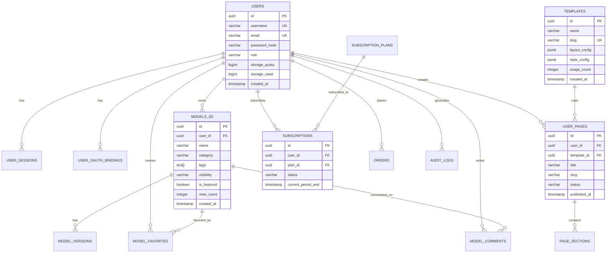

# Web3D平台数据库Schema设计文档

> 📅 创建日期：2025年4月18日  
> 📄 文档版本：v2.0（国际化增强版）  
> 🗄️ 数据库：PostgreSQL 16+  
> 🔒 安全标准：企业级数据加密与隔离  
> 🌍 国际化：支持中英文切换  
> 💬 注释标准：所有字段含中英双语注释

---

## 📚 目录

1. [设计原则](#一设计原则)
2. [国际化设计方案](#二国际化设计方案)
3. [状态枚举完整定义](#三状态枚举完整定义)
4. [ER关系图](#四er关系图)
5. [核心表结构（含双语注释）](#五核心表结构含双语注释)
6. [索引策略](#六索引策略)
7. [视图与存储过程](#七视图与存储过程)
8. [数据迁移策略](#八数据迁移策略)
9. [备份与恢复](#九备份与恢复)
10. [性能优化](#十性能优化)

---

## 一、设计原则

### 1.1 命名规范

- **表名**: 小写+下划线，复数形式（`users`, `models_3d`）
- **字段名**: 小写+下划线（`user_id`, `created_at`）
- **主键**: `id UUID PRIMARY KEY DEFAULT gen_random_uuid()`
- **外键**: `{关联表}_id`（`user_id`, `model_id`）
- **时间字段**: `{action}_at`（`created_at`, `updated_at`, `deleted_at`）
- **布尔字段**: `is_{状态}`（`is_active`, `is_deleted`）

### 1.2 数据类型选择

| 场景 | 推荐类型 | 说明 |
|------|---------|------|
| 主键 | UUID | 分布式友好，安全性高 |
| 整数 | INTEGER / BIGINT | 根据范围选择 |
| 小数 | DECIMAL(10,2) | 金额等精确计算 |
| 文本 | VARCHAR(n) / TEXT | 短文本用VARCHAR，长文本用TEXT |
| JSON | JSONB | 支持索引和查询 |
| 时间 | TIMESTAMP WITH TIME ZONE | 带时区 |
| 布尔 | BOOLEAN | - |
| 数组 | TEXT[] | PostgreSQL数组类型 |
| IP地址 | INET | 专用IP类型 |

### 1.3 约束规范

- **NOT NULL**: 必填字段
- **UNIQUE**: 唯一约束（邮箱、用户名）
- **CHECK**: 值域约束（状态枚举）
- **FOREIGN KEY**: 外键约束（CASCADE/RESTRICT）
- **DEFAULT**: 默认值

### 1.4 软删除策略

所有核心业务表采用软删除：
```sql
deleted_at TIMESTAMP WITH TIME ZONE DEFAULT NULL
```

查询时自动过滤：
```sql
WHERE deleted_at IS NULL
```

---

## 二、国际化设计方案

### 2.1 国际化策略

本系统采用**三层国际化架构**：

```
┌─────────────────────────────────────────────────────┐
│           Layer 1: 界面文本国际化                      │
│     (前端i18n文件：zh-CN.json, en-US.json)            │
└─────────────────────────────────────────────────────┘
                        ↓
┌─────────────────────────────────────────────────────┐
│         Layer 2: 业务数据国际化                        │
│   (数据库多语言表：translations, i18n_resources)      │
└─────────────────────────────────────────────────────┘
                        ↓
┌─────────────────────────────────────────────────────┐
│        Layer 3: 元数据国际化                           │
│    (数据库字段注释：COMMENT ON COLUMN)                │
└─────────────────────────────────────────────────────┘
```

### 2.2 数据库层面国际化实现

#### 方案：JSONB存储多语言内容（推荐）⭐

**优势**：
- ✅ 灵活扩展，支持任意语言
- ✅ 无需修改表结构
- ✅ PostgreSQL原生支持JSONB索引
- ✅ 查询性能好

**实现示例**：

```sql
-- 模板表多语言字段
CREATE TABLE templates (
    id UUID PRIMARY KEY,
    slug VARCHAR(255) UNIQUE,
    category VARCHAR(50),
    
    -- 多语言内容存储在JSONB中
    name_i18n JSONB NOT NULL DEFAULT '{"zh-CN": "", "en-US": ""}',
    description_i18n JSONB DEFAULT '{"zh-CN": "", "en-US": ""}',
    
    created_at TIMESTAMP WITH TIME ZONE DEFAULT NOW()
);

-- 创建GIN索引加速JSONB查询
CREATE INDEX idx_templates_name_i18n ON templates USING GIN(name_i18n);
```

**查询示例**：

```sql
-- 查询中文名称
SELECT name_i18n->>'zh-CN' AS name_zh FROM templates WHERE id = 'uuid';

-- 查询英文名称
SELECT name_i18n->>'en-US' AS name_en FROM templates WHERE id = 'uuid';

-- 根据语言动态查询
SELECT 
    CASE 
        WHEN current_setting('app.locale') = 'zh-CN' THEN name_i18n->>'zh-CN'
        ELSE name_i18n->>'en-US'
    END AS localized_name
FROM templates;
```

### 2.3 需要国际化的表字段

| 表名 | 需国际化字段 | 说明 |
|------|------------|------|
| users | - | 用户名、邮箱不需国际化 |
| models_3d | name, description | 模型名称和描述 |
| templates | name, description, features | 模板名称、描述、功能列表 |
| subscription_plans | name, description, features | 套餐名称、描述、功能 |
| page_sections | config (部分字段) | 区块配置中的文本内容 |

### 2.4 国际化数据初始化

```sql
-- 插入多语言模板数据
INSERT INTO templates (slug, category, name_i18n, description_i18n) VALUES
(
    'modern-gallery',
    'gallery',
    '{"zh-CN": "现代画廊", "en-US": "Modern Gallery"}',
    '{"zh-CN": "适合展示3D模型的现代化布局", "en-US": "Modern layout for showcasing 3D models"}'
),
(
    'portfolio-showcase',
    'portfolio',
    '{"zh-CN": "作品集展示", "en-US": "Portfolio Showcase"}',
    '{"zh-CN": "专业的作品集展示页面", "en-US": "Professional portfolio showcase page"}'
);
```

### 2.5 后端国际化支持

**FastAPI中间件设置当前语言**：

```python
from fastapi import Request

@app.middleware("http")
async def set_locale(request: Request, call_next):
    # 从请求头获取语言偏好
    accept_language = request.headers.get("Accept-Language", "zh-CN")
    locale = accept_language.split(",")[0] if accept_language else "zh-CN"
    
    # 设置到上下文
    request.state.locale = locale
    
    response = await call_next(request)
    return response
```

**SQLAlchemy查询时自动选择语言**：

```python
from sqlalchemy import func

def get_localized_name(model, locale='zh-CN'):
    """获取本地化名称"""
    return func.jsonb_extract_path_text(model.name_i18n, locale)
```

---

## 三、状态枚举完整定义

### 3.1 用户相关枚举

#### 用户角色 (users.role)

| 枚举值 | 中文说明 | 英文说明 | 权限级别 | 使用场景 |
|--------|---------|---------|---------|---------|
| `admin` | 管理员 | Administrator | 最高 | 系统管理、用户管理、内容审核 |
| `editor` | 编辑者 | Editor | 高 | 内容管理、模板管理 |
| `user` | 普通用户 | Regular User | 中 | 模型生成、页面创建 |
| `guest` | 访客 | Guest | 低 | 仅浏览公开内容 |

#### 用户状态 (users.status)

| 枚举值 | 中文说明 | 英文说明 | 说明 |
|--------|---------|---------|------|
| `active` | 活跃 | Active | 正常可用状态 |
| `inactive` | 非活跃 | Inactive | 长期未登录 |
| `banned` | 已封禁 | Banned | 违规被封禁 |
| `pending_verification` | 待验证 | Pending Verification | 注册后等待邮箱验证 |

### 3.2 3D模型相关枚举

#### 模型分类 (models_3d.category)

| 枚举值 | 中文说明 | 英文说明 | 示例 |
|--------|---------|---------|------|
| `product` | 产品 | Product | 椅子、桌子等商品 |
| `character` | 角色 | Character | 人物、动物角色 |
| `scene` | 场景 | Scene | 室内、室外场景 |
| `architecture` | 建筑 | Architecture | 建筑物、房屋 |
| `other` | 其他 | Other | 其他类型 |

#### 模型来源类型 (models_3d.source_type)

| 枚举值 | 中文说明 | 英文说明 | 说明 |
|--------|---------|---------|------|
| `upload` | 上传 | Upload | 用户上传的GLB/OBJ文件 |
| `generate` | AI生成 | AI Generated | 通过Hunyuan3D/TripoSR生成 |
| `import` | 导入 | Import | 从外部系统导入 |

#### 模型可见性 (models_3d.visibility)

| 枚举值 | 中文说明 | 英文说明 | 说明 |
|--------|---------|---------|------|
| `public` | 公开 | Public | 所有人可见 |
| `private` | 私有 | Private | 仅所有者可见 |
| `unlisted` | 未列出 | Unlisted | 通过链接访问，不显示在列表中 |

#### 模型处理状态 (models_3d.processing_status)

| 枚举值 | 中文说明 | 英文说明 | 说明 |
|--------|---------|---------|------|
| `pending` | 待处理 | Pending | 任务已提交，等待处理 |
| `processing` | 处理中 | Processing | 正在生成/转换 |
| `completed` | 已完成 | Completed | 处理成功完成 |
| `failed` | 失败 | Failed | 处理失败 |

#### 模型审核状态 (models_3d.moderation_status)

| 枚举值 | 中文说明 | 英文说明 | 说明 |
|--------|---------|---------|------|
| `pending` | 待审核 | Pending Review | 等待管理员审核 |
| `approved` | 已通过 | Approved | 审核通过，可公开 |
| `rejected` | 已拒绝 | Rejected | 审核拒绝，需修改 |

### 3.3 页面相关枚举

#### 页面状态 (user_pages.status)

| 枚举值 | 中文说明 | 英文说明 | 说明 |
|--------|---------|---------|------|
| `draft` | 草稿 | Draft | 编辑中，未发布 |
| `published` | 已发布 | Published | 已发布，公开可见 |
| `archived` | 已归档 | Archived | 已归档，不显示 |

#### 区块类型 (page_sections.section_type)

| 枚举值 | 中文说明 | 英文说明 | 说明 |
|--------|---------|---------|------|
| `hero` | 英雄区 | Hero Section | 顶部大图+标题 |
| `gallery` | 画廊 | Gallery | 3D模型网格展示 |
| `text` | 文本 | Text | 富文本内容 |
| `video` | 视频 | Video | 嵌入视频 |
| `3d_viewer` | 3D查看器 | 3D Viewer | 交互式3D模型查看 |
| `contact` | 联系表单 | Contact Form | 联系方式表单 |
| `custom` | 自定义 | Custom | 自定义HTML/JS |

### 3.4 订阅支付相关枚举

#### 账单周期 (subscriptions.billing_cycle)

| 枚举值 | 中文说明 | 英文说明 | 说明 |
|--------|---------|---------|------|
| `monthly` | 月度 | Monthly | 每月付费 |
| `yearly` | 年度 | Yearly | 每年付费（通常有折扣） |

#### 订阅状态 (subscriptions.status)

| 枚举值 | 中文说明 | 英文说明 | 说明 |
|--------|---------|---------|------|
| `active` | 活跃 | Active | 正常订阅中 |
| `cancelled` | 已取消 | Cancelled | 用户主动取消 |
| `expired` | 已过期 | Expired | 订阅到期未续费 |
| `past_due` | 逾期 | Past Due | 付款逾期 |
| `trialing` | 试用中 | Trialing | 免费试用期 |

#### 订单状态 (orders.status)

| 枚举值 | 中文说明 | 英文说明 | 说明 |
|--------|---------|---------|------|
| `pending` | 待支付 | Pending Payment | 订单创建，等待支付 |
| `paid` | 已支付 | Paid | 支付成功 |
| `failed` | 支付失败 | Payment Failed | 支付失败 |
| `refunded` | 已退款 | Refunded | 已退款 |
| `cancelled` | 已取消 | Cancelled | 订单取消 |

#### 发票状态 (invoices.status)

| 枚举值 | 中文说明 | 英文说明 | 说明 |
|--------|---------|---------|------|
| `draft` | 草稿 | Draft | 发票草稿 |
| `sent` | 已发送 | Sent | 已发送给客户 |
| `paid` | 已支付 | Paid | 发票已支付 |
| `void` | 已作废 | Void | 发票作废 |

### 3.5 任务队列相关枚举

#### 任务类型 (generation_tasks.task_type)

| 枚举值 | 中文说明 | 英文说明 | 说明 |
|--------|---------|---------|------|
| `model_generation` | 模型生成 | Model Generation | 3D模型AI生成 |
| `format_conversion` | 格式转换 | Format Conversion | GLB/Splat/OBJ转换 |
| `thumbnail_generation` | 缩略图生成 | Thumbnail Generation | 生成模型预览图 |

#### 任务状态 (generation_tasks.status)

| 枚举值 | 中文说明 | 英文说明 | 说明 |
|--------|---------|---------|------|
| `queued` | 排队中 | Queued | 任务已提交，等待执行 |
| `processing` | 处理中 | Processing | 正在执行 |
| `completed` | 已完成 | Completed | 执行成功 |
| `failed` | 失败 | Failed | 执行失败 |
| `cancelled` | 已取消 | Cancelled | 用户取消或超时 |

### 3.6 OAuth提供商枚举

#### OAuth提供商 (user_oauth_bindings.provider)

| 枚举值 | 中文说明 | 英文说明 | 说明 |
|--------|---------|---------|------|
| `google` | 谷歌 | Google | Google OAuth2 |
| `github` | GitHub | GitHub | GitHub OAuth2 |
| `wechat` | 微信 | WeChat | 微信开放平台 |
| `apple` | 苹果 | Apple | Sign in with Apple |

---

## 四、ER关系图



---

## 三、核心表结构

### 3.1 用户系统

#### users - 用户表

**表说明 / Table Description**: 存储系统用户基本信息、角色、配额等  
**Stores**: User basic information, roles, quotas, etc.

```sql
CREATE TABLE users (
    -- ========================================
    -- 主键 / Primary Key
    -- ========================================
    id UUID PRIMARY KEY DEFAULT gen_random_uuid(),  -- 用户唯一标识符 / Unique user identifier
    
    -- ========================================
    -- 基本信息 / Basic Information
    -- ========================================
    username VARCHAR(50) UNIQUE NOT NULL,  -- 用户名（3-50字符，字母数字下划线）/ Username (3-50 chars, alphanumeric + underscore)
    email VARCHAR(255) UNIQUE NOT NULL,  -- 邮箱地址 / Email address
    password_hash VARCHAR(255) NOT NULL,  -- bcrypt加密的密码哈希 / Bcrypt hashed password
    phone VARCHAR(20),  -- 手机号码（可选）/ Phone number (optional)
    avatar_url TEXT,  -- 头像URL / Avatar image URL
    
    -- ========================================
    -- 角色与状态 / Role & Status
    -- ========================================
    role VARCHAR(20) NOT NULL DEFAULT 'user'  -- 用户角色：admin/editor/user/guest / User role: admin/editor/user/guest
        CHECK (role IN ('admin', 'editor', 'user', 'guest')),
    status VARCHAR(20) NOT NULL DEFAULT 'active'  -- 用户状态：active/inactive/banned/pending_verification / User status
        CHECK (status IN ('active', 'inactive', 'banned', 'pending_verification')),
    
    -- ========================================
    -- 配额管理 / Quota Management
    -- ========================================
    storage_quota BIGINT NOT NULL DEFAULT 1073741824,  -- 存储配额（字节），默认1GB / Storage quota in bytes, default 1GB
    storage_used BIGINT NOT NULL DEFAULT 0,  -- 已使用存储空间（字节）/ Used storage in bytes
    monthly_generations INTEGER NOT NULL DEFAULT 10,  -- 每月AI生成次数配额 / Monthly AI generation quota
    generations_used INTEGER NOT NULL DEFAULT 0,  -- 本月已使用生成次数 / Generations used this month
    generation_quota_reset_at TIMESTAMP WITH TIME ZONE,  -- 配额重置时间 / Quota reset timestamp
    
    -- ========================================
    -- 时间戳 / Timestamps
    -- ========================================
    email_verified_at TIMESTAMP WITH TIME ZONE,  -- 邮箱验证时间 / Email verification timestamp
    last_login_at TIMESTAMP WITH TIME ZONE,  -- 最后登录时间 / Last login timestamp
    last_login_ip INET,  -- 最后登录IP地址 / Last login IP address
    created_at TIMESTAMP WITH TIME ZONE NOT NULL DEFAULT NOW(),  -- 创建时间 / Creation timestamp
    updated_at TIMESTAMP WITH TIME ZONE NOT NULL DEFAULT NOW(),  -- 更新时间 / Last update timestamp
    deleted_at TIMESTAMP WITH TIME ZONE DEFAULT NULL  -- 软删除时间（NULL表示未删除）/ Soft delete timestamp (NULL = not deleted)
);

-- ========================================
-- 索引 / Indexes
-- ========================================
CREATE INDEX idx_users_email ON users(email) WHERE deleted_at IS NULL;  -- 邮箱索引（加速登录查询）
CREATE INDEX idx_users_username ON users(username) WHERE deleted_at IS NULL;  -- 用户名索引
CREATE INDEX idx_users_role ON users(role);  -- 角色索引（加速权限筛选）
CREATE INDEX idx_users_status ON users(status);  -- 状态索引
CREATE INDEX idx_users_created_at ON users(created_at DESC);  -- 创建时间索引（加速最新用户查询）

-- ========================================
-- 触发器：自动更新updated_at
-- Trigger: Auto-update updated_at
-- ========================================
CREATE OR REPLACE FUNCTION update_updated_at_column()
RETURNS TRIGGER AS $$
BEGIN
    NEW.updated_at = NOW();
    RETURN NEW;
END;
$$ language 'plpgsql';

CREATE TRIGGER update_users_updated_at 
    BEFORE UPDATE ON users 
    FOR EACH ROW 
    EXECUTE FUNCTION update_updated_at_column();

-- ========================================
-- 字段注释（中英双语）
-- Column Comments (Bilingual)
-- ========================================
COMMENT ON TABLE users IS '用户表 - Stores system user information';
COMMENT ON COLUMN users.id IS '用户唯一ID - Unique user identifier';
COMMENT ON COLUMN users.username IS '用户名 - Username for login and display';
COMMENT ON COLUMN users.email IS '邮箱地址 - Email address for login and notifications';
COMMENT ON COLUMN users.password_hash IS '密码哈希（bcrypt加密）- Password hash encrypted with bcrypt';
COMMENT ON COLUMN users.phone IS '手机号码 - Phone number for SMS notifications';
COMMENT ON COLUMN users.avatar_url IS '头像URL - URL of user avatar image';
COMMENT ON COLUMN users.role IS '用户角色：admin(管理员)/editor(编辑)/user(普通用户)/guest(访客) - User role';
COMMENT ON COLUMN users.status IS '用户状态：active(活跃)/inactive(非活跃)/banned(封禁)/pending_verification(待验证) - User account status';
COMMENT ON COLUMN users.storage_quota IS '存储配额（字节）- Storage quota in bytes';
COMMENT ON COLUMN users.storage_used IS '已使用存储（字节）- Used storage in bytes';
COMMENT ON COLUMN users.monthly_generations IS '每月AI生成次数配额 - Monthly AI generation quota';
COMMENT ON COLUMN users.generations_used IS '本月已使用生成次数 - Generations used this month';
COMMENT ON COLUMN users.generation_quota_reset_at IS '配额重置时间 - Quota reset timestamp';
COMMENT ON COLUMN users.email_verified_at IS '邮箱验证时间 - Email verification timestamp';
COMMENT ON COLUMN users.last_login_at IS '最后登录时间 - Last login timestamp';
COMMENT ON COLUMN users.last_login_ip IS '最后登录IP地址 - Last login IP address';
COMMENT ON COLUMN users.created_at IS '账户创建时间 - Account creation timestamp';
COMMENT ON COLUMN users.updated_at IS '最后更新时间 - Last update timestamp';
COMMENT ON COLUMN users.deleted_at IS '软删除时间（NULL=未删除）- Soft delete timestamp (NULL=not deleted)';
```

#### user_sessions - 用户会话表

```sql
CREATE TABLE user_sessions (
    id UUID PRIMARY KEY DEFAULT gen_random_uuid(),
    user_id UUID NOT NULL REFERENCES users(id) ON DELETE CASCADE,
    
    -- Token信息
    token_hash VARCHAR(255) NOT NULL,
    refresh_token_hash VARCHAR(255),
    
    -- 设备信息
    ip_address INET,
    user_agent TEXT,
    device_info JSONB,
    
    -- 地理位置
    country VARCHAR(100),
    city VARCHAR(100),
    
    -- 时间戳
    expires_at TIMESTAMP WITH TIME ZONE NOT NULL,
    last_active_at TIMESTAMP WITH TIME ZONE NOT NULL DEFAULT NOW(),
    created_at TIMESTAMP WITH TIME ZONE NOT NULL DEFAULT NOW()
);

CREATE INDEX idx_sessions_user_id ON user_sessions(user_id);
CREATE INDEX idx_sessions_token_hash ON user_sessions(token_hash);
CREATE INDEX idx_sessions_expires_at ON user_sessions(expires_at);
CREATE INDEX idx_sessions_last_active ON user_sessions(last_active_at DESC);

-- 定期清理过期会话
CREATE INDEX idx_sessions_expired ON user_sessions(expires_at) 
    WHERE expires_at < NOW();

COMMENT ON TABLE user_sessions IS '用户会话表';
```

#### user_oauth_bindings - OAuth绑定表

```sql
CREATE TABLE user_oauth_bindings (
    id UUID PRIMARY KEY DEFAULT gen_random_uuid(),
    user_id UUID NOT NULL REFERENCES users(id) ON DELETE CASCADE,
    
    -- OAuth提供商信息
    provider VARCHAR(50) NOT NULL 
        CHECK (provider IN ('google', 'github', 'wechat', 'apple')),
    provider_user_id VARCHAR(255) NOT NULL,
    provider_username VARCHAR(255),
    
    -- Token（加密存储）
    access_token_encrypted TEXT,
    refresh_token_encrypted TEXT,
    token_expires_at TIMESTAMP WITH TIME ZONE,
    
    -- 元数据
    extra_data JSONB,
    
    created_at TIMESTAMP WITH TIME ZONE NOT NULL DEFAULT NOW(),
    updated_at TIMESTAMP WITH TIME ZONE NOT NULL DEFAULT NOW(),
    
    UNIQUE(provider, provider_user_id)
);

CREATE INDEX idx_oauth_user_id ON user_oauth_bindings(user_id);
CREATE INDEX idx_oauth_provider ON user_oauth_bindings(provider);

COMMENT ON TABLE user_oauth_bindings IS '用户OAuth绑定表';
```

---

### 3.2 3D模型系统

#### models_3d - 3D模型表

**表说明 / Table Description**: 存储3D模型元数据、文件路径、统计信息等  
**Stores**: 3D model metadata, file paths, statistics, etc.

```sql
CREATE TABLE models_3d (
    -- ========================================
    -- 主键 / Primary Key
    -- ========================================
    id UUID PRIMARY KEY DEFAULT gen_random_uuid(),  -- 模型唯一标识符 / Unique model identifier
    
    -- ========================================
    -- 所有者 / Owner
    -- ========================================
    user_id UUID NOT NULL REFERENCES users(id) ON DELETE CASCADE,  -- 所有者用户ID / Owner user ID
    
    -- ========================================
    -- 基本信息 / Basic Information
    -- ========================================
    name VARCHAR(255) NOT NULL,  -- 模型名称（支持多语言，见name_i18n字段）/ Model name (see name_i18n for i18n)
    description TEXT,  -- 模型描述（支持多语言，见description_i18n字段）/ Model description (see description_i18n for i18n)
    category VARCHAR(50)  -- 模型分类：product/character/scene/architecture/other / Model category
        CHECK (category IN ('product', 'character', 'scene', 'architecture', 'other')),
    tags TEXT[] DEFAULT '{}',  -- 标签数组（用于搜索和筛选）/ Tags array for search and filtering
    
    -- ========================================
    -- 来源信息 / Source Information
    -- ========================================
    source_type VARCHAR(20) NOT NULL DEFAULT 'upload'  -- 来源类型：upload(上传)/generate(AI生成)/import(导入) / Source type
        CHECK (source_type IN ('upload', 'generate', 'import')),
    generation_engine VARCHAR(50),  -- AI生成引擎：hunyuan3d/triposr/custom / AI generation engine
    original_file_path TEXT,  -- 原始上传文件路径 / Original uploaded file path
    
    -- ========================================
    -- 文件路径 / File Paths
    -- ========================================
    glb_file_path TEXT,  -- GLB格式文件路径 / GLB format file path
    splat_file_path TEXT,  -- Splat高斯点阵文件路径 / Splat Gaussian splatting file path
    obj_file_path TEXT,  -- OBJ格式文件路径 / OBJ format file path
    thumbnail_path TEXT,  -- 缩略图路径 / Thumbnail image path
    preview_video_path TEXT,  -- 预览视频路径 / Preview video path
    
    -- ========================================
    -- 文件元数据 / File Metadata
    -- ========================================
    file_size BIGINT,  -- 文件大小（字节）/ File size in bytes
    polygon_count INTEGER,  -- 多边形数量 / Polygon count
    vertex_count INTEGER,  -- 顶点数量 / Vertex count
    texture_resolution VARCHAR(20),  -- 纹理分辨率：1024x1024, 2048x2048等 / Texture resolution
    format_version VARCHAR(20),  -- 文件格式版本 / File format version
    
    -- ========================================
    -- 生成参数（JSONB）/ Generation Parameters (JSONB)
    -- ========================================
    generation_params JSONB,  -- AI生成时的参数配置 / AI generation parameters configuration
    
    -- ========================================
    -- 质量评分 / Quality Score
    -- ========================================
    quality_score FLOAT CHECK (quality_score >= 0 AND quality_score <= 1),  -- AI质量评分（0-1）/ AI quality score (0-1)
    
    -- ========================================
    -- 处理状态 / Processing Status
    -- ========================================
    processing_status VARCHAR(20) NOT NULL DEFAULT 'pending'  -- 处理状态：pending/processing/completed/failed / Processing status
        CHECK (processing_status IN ('pending', 'processing', 'completed', 'failed')),
    error_message TEXT,  -- 错误信息（失败时填写）/ Error message (when failed)
    
    -- ========================================
    -- 访问控制 / Access Control
    -- ========================================
    visibility VARCHAR(20) NOT NULL DEFAULT 'private'  -- 可见性：public(公开)/private(私有)/unlisted(未列出) / Visibility
        CHECK (visibility IN ('public', 'private', 'unlisted')),
    is_featured BOOLEAN NOT NULL DEFAULT FALSE,  -- 是否精选模型 / Is featured model
    featured_priority INTEGER DEFAULT 0,  -- 精选优先级（数字越大越靠前）/ Featured priority (higher = more prominent)
    
    -- ========================================
    -- 审核状态 / Moderation Status
    -- ========================================
    moderation_status VARCHAR(20) NOT NULL DEFAULT 'pending'  -- 审核状态：pending/approved/rejected / Moderation status
        CHECK (moderation_status IN ('pending', 'approved', 'rejected')),
    moderated_by UUID REFERENCES users(id),  -- 审核人ID / Moderator user ID
    moderated_at TIMESTAMP WITH TIME ZONE,  -- 审核时间 / Moderation timestamp
    moderation_reason TEXT,  -- 审核原因（拒绝时填写）/ Moderation reason (when rejected)
    
    -- ========================================
    -- 统计信息 / Statistics
    -- ========================================
    view_count INTEGER NOT NULL DEFAULT 0,  -- 浏览量 / View count
    download_count INTEGER NOT NULL DEFAULT 0,  -- 下载次数 / Download count
    like_count INTEGER NOT NULL DEFAULT 0,  -- 点赞数 / Like count
    comment_count INTEGER NOT NULL DEFAULT 0,  -- 评论数 / Comment count
    favorite_count INTEGER NOT NULL DEFAULT 0,  -- 收藏数 / Favorite count
    
    -- ========================================
    -- 多语言支持 / Internationalization Support
    -- ========================================
    name_i18n JSONB DEFAULT '{"zh-CN": "", "en-US": ""}',  -- 多语言名称 / Localized names
    description_i18n JSONB DEFAULT '{"zh-CN": "", "en-US": ""}',  -- 多语言描述 / Localized descriptions
    
    -- ========================================
    -- 时间戳 / Timestamps
    -- ========================================
    created_at TIMESTAMP WITH TIME ZONE NOT NULL DEFAULT NOW(),  -- 创建时间 / Creation timestamp
    updated_at TIMESTAMP WITH TIME ZONE NOT NULL DEFAULT NOW(),  -- 更新时间 / Last update timestamp
    published_at TIMESTAMP WITH TIME ZONE,  -- 发布时间 / Publication timestamp
    deleted_at TIMESTAMP WITH TIME ZONE DEFAULT NULL  -- 软删除时间 / Soft delete timestamp
);

-- ========================================
-- 索引 / Indexes
-- ========================================
CREATE INDEX idx_models_user_id ON models_3d(user_id) WHERE deleted_at IS NULL;  -- 用户ID索引
CREATE INDEX idx_models_category ON models_3d(category) WHERE deleted_at IS NULL;  -- 分类索引
CREATE INDEX idx_models_visibility ON models_3d(visibility) WHERE deleted_at IS NULL;  -- 可见性索引
CREATE INDEX idx_models_processing_status ON models_3d(processing_status);  -- 处理状态索引
CREATE INDEX idx_models_moderation_status ON models_3d(moderation_status);  -- 审核状态索引
CREATE INDEX idx_models_created_at ON models_3d(created_at DESC) WHERE deleted_at IS NULL;  -- 创建时间索引
CREATE INDEX idx_models_view_count ON models_3d(view_count DESC) WHERE deleted_at IS NULL;  -- 浏览量索引
CREATE INDEX idx_models_is_featured ON models_3d(is_featured) WHERE is_featured = TRUE;  -- 精选模型索引
CREATE INDEX idx_models_tags ON models_3d USING GIN(tags);  -- 标签GIN索引（加速数组查询）

-- 全文搜索索引（支持中英文名称搜索）
CREATE INDEX idx_models_search ON models_3d 
    USING GIN(to_tsvector('english', COALESCE(name, '') || ' ' || COALESCE(description, '')));

-- 多语言字段GIN索引
CREATE INDEX idx_models_name_i18n ON models_3d USING GIN(name_i18n);
CREATE INDEX idx_models_description_i18n ON models_3d USING GIN(description_i18n);

-- ========================================
-- 触发器
-- Triggers
-- ========================================
CREATE TRIGGER update_models_updated_at 
    BEFORE UPDATE ON models_3d 
    FOR EACH ROW 
    EXECUTE FUNCTION update_updated_at_column();

-- ========================================
-- 字段注释（中英双语）
-- Column Comments (Bilingual)
-- ========================================
COMMENT ON TABLE models_3d IS '3D模型表 - Stores 3D model metadata and files';
COMMENT ON COLUMN models_3d.id IS '模型唯一ID - Unique model identifier';
COMMENT ON COLUMN models_3d.user_id IS '所有者用户ID - Owner user ID';
COMMENT ON COLUMN models_3d.name IS '模型名称 - Model name';
COMMENT ON COLUMN models_3d.description IS '模型描述 - Model description';
COMMENT ON COLUMN models_3d.category IS '模型分类：product(产品)/character(角色)/scene(场景)/architecture(建筑)/other(其他) - Model category';
COMMENT ON COLUMN models_3d.tags IS '标签数组 - Tags array for search and filtering';
COMMENT ON COLUMN models_3d.source_type IS '来源类型：upload(上传)/generate(AI生成)/import(导入) - Source type';
COMMENT ON COLUMN models_3d.generation_engine IS 'AI生成引擎：hunyuan3d/triposr/custom - AI generation engine';
COMMENT ON COLUMN models_3d.original_file_path IS '原始上传文件路径 - Original uploaded file path';
COMMENT ON COLUMN models_3d.glb_file_path IS 'GLB格式文件路径 - GLB format file path';
COMMENT ON COLUMN models_3d.splat_file_path IS 'Splat高斯点阵文件路径 - Splat Gaussian splatting file path';
COMMENT ON COLUMN models_3d.obj_file_path IS 'OBJ格式文件路径 - OBJ format file path';
COMMENT ON COLUMN models_3d.thumbnail_path IS '缩略图路径 - Thumbnail image path';
COMMENT ON COLUMN models_3d.preview_video_path IS '预览视频路径 - Preview video path';
COMMENT ON COLUMN models_3d.file_size IS '文件大小（字节）- File size in bytes';
COMMENT ON COLUMN models_3d.polygon_count IS '多边形数量 - Polygon count';
COMMENT ON COLUMN models_3d.vertex_count IS '顶点数量 - Vertex count';
COMMENT ON COLUMN models_3d.texture_resolution IS '纹理分辨率 - Texture resolution (e.g., 2048x2048)';
COMMENT ON COLUMN models_3d.format_version IS '文件格式版本 - File format version';
COMMENT ON COLUMN models_3d.generation_params IS 'AI生成参数配置 - AI generation parameters configuration';
COMMENT ON COLUMN models_3d.quality_score IS 'AI质量评分（0-1）- AI quality score (0-1)';
COMMENT ON COLUMN models_3d.processing_status IS '处理状态：pending(待处理)/processing(处理中)/completed(已完成)/failed(失败) - Processing status';
COMMENT ON COLUMN models_3d.error_message IS '错误信息 - Error message when processing fails';
COMMENT ON COLUMN models_3d.visibility IS '可见性：public(公开)/private(私有)/unlisted(未列出) - Visibility';
COMMENT ON COLUMN models_3d.is_featured IS '是否精选模型 - Is featured model';
COMMENT ON COLUMN models_3d.featured_priority IS '精选优先级 - Featured priority';
COMMENT ON COLUMN models_3d.moderation_status IS '审核状态：pending(待审核)/approved(已通过)/rejected(已拒绝) - Moderation status';
COMMENT ON COLUMN models_3d.moderated_by IS '审核人ID - Moderator user ID';
COMMENT ON COLUMN models_3d.moderated_at IS '审核时间 - Moderation timestamp';
COMMENT ON COLUMN models_3d.moderation_reason IS '审核原因 - Moderation reason';
COMMENT ON COLUMN models_3d.view_count IS '浏览量 - View count';
COMMENT ON COLUMN models_3d.download_count IS '下载次数 - Download count';
COMMENT ON COLUMN models_3d.like_count IS '点赞数 - Like count';
COMMENT ON COLUMN models_3d.comment_count IS '评论数 - Comment count';
COMMENT ON COLUMN models_3d.favorite_count IS '收藏数 - Favorite count';
COMMENT ON COLUMN models_3d.name_i18n IS '多语言名称JSONB - Localized names in JSONB format';
COMMENT ON COLUMN models_3d.description_i18n IS '多语言描述JSONB - Localized descriptions in JSONB format';
COMMENT ON COLUMN models_3d.created_at IS '创建时间 - Creation timestamp';
COMMENT ON COLUMN models_3d.updated_at IS '更新时间 - Last update timestamp';
COMMENT ON COLUMN models_3d.published_at IS '发布时间 - Publication timestamp';
COMMENT ON COLUMN models_3d.deleted_at IS '软删除时间 - Soft delete timestamp';
```

#### model_versions - 模型版本表

```sql
CREATE TABLE model_versions (
    id UUID PRIMARY KEY DEFAULT gen_random_uuid(),
    model_id UUID NOT NULL REFERENCES models_3d(id) ON DELETE CASCADE,
    
    version_number INTEGER NOT NULL,
    file_path TEXT NOT NULL,
    file_size BIGINT,
    change_log TEXT,
    
    created_by UUID NOT NULL REFERENCES users(id),
    created_at TIMESTAMP WITH TIME ZONE NOT NULL DEFAULT NOW()
);

CREATE INDEX idx_versions_model_id ON model_versions(model_id);
CREATE INDEX idx_versions_number ON model_versions(model_id, version_number DESC);

-- 确保版本号唯一
CREATE UNIQUE INDEX idx_versions_unique ON model_versions(model_id, version_number);

COMMENT ON TABLE model_versions IS '模型版本历史表';
```

#### model_favorites - 模型收藏表

```sql
CREATE TABLE model_favorites (
    id UUID PRIMARY KEY DEFAULT gen_random_uuid(),
    user_id UUID NOT NULL REFERENCES users(id) ON DELETE CASCADE,
    model_id UUID NOT NULL REFERENCES models_3d(id) ON DELETE CASCADE,
    
    created_at TIMESTAMP WITH TIME ZONE NOT NULL DEFAULT NOW(),
    
    UNIQUE(user_id, model_id)
);

CREATE INDEX idx_favorites_user_id ON model_favorites(user_id);
CREATE INDEX idx_favorites_model_id ON model_favorites(model_id);
CREATE INDEX idx_favorites_created ON model_favorites(created_at DESC);

COMMENT ON TABLE model_favorites IS '模型收藏表';
```

#### model_comments - 模型评论表

```sql
CREATE TABLE model_comments (
    id UUID PRIMARY KEY DEFAULT gen_random_uuid(),
    model_id UUID NOT NULL REFERENCES models_3d(id) ON DELETE CASCADE,
    user_id UUID NOT NULL REFERENCES users(id) ON DELETE CASCADE,
    
    -- 嵌套评论
    parent_id UUID REFERENCES model_comments(id) ON DELETE CASCADE,
    
    content TEXT NOT NULL,
    
    -- 审核
    is_approved BOOLEAN NOT NULL DEFAULT TRUE,
    moderated_by UUID REFERENCES users(id),
    moderated_at TIMESTAMP WITH TIME ZONE,
    
    -- 统计
    like_count INTEGER NOT NULL DEFAULT 0,
    
    created_at TIMESTAMP WITH TIME ZONE NOT NULL DEFAULT NOW(),
    updated_at TIMESTAMP WITH TIME ZONE NOT NULL DEFAULT NOW(),
    deleted_at TIMESTAMP WITH TIME ZONE DEFAULT NULL
);

CREATE INDEX idx_comments_model_id ON model_comments(model_id) WHERE deleted_at IS NULL;
CREATE INDEX idx_comments_user_id ON model_comments(user_id);
CREATE INDEX idx_comments_parent_id ON model_comments(parent_id);
CREATE INDEX idx_comments_approved ON model_comments(is_approved) WHERE is_approved = TRUE;
CREATE INDEX idx_comments_created ON model_comments(created_at DESC) WHERE deleted_at IS NULL;

CREATE TRIGGER update_comments_updated_at 
    BEFORE UPDATE ON model_comments 
    FOR EACH ROW 
    EXECUTE FUNCTION update_updated_at_column();

COMMENT ON TABLE model_comments IS '模型评论表';
```

#### model_likes - 模型点赞表

```sql
CREATE TABLE model_likes (
    id UUID PRIMARY KEY DEFAULT gen_random_uuid(),
    user_id UUID NOT NULL REFERENCES users(id) ON DELETE CASCADE,
    model_id UUID NOT NULL REFERENCES models_3d(id) ON DELETE CASCADE,
    
    created_at TIMESTAMP WITH TIME ZONE NOT NULL DEFAULT NOW(),
    
    UNIQUE(user_id, model_id)
);

CREATE INDEX idx_likes_user_id ON model_likes(user_id);
CREATE INDEX idx_likes_model_id ON model_likes(model_id);

COMMENT ON TABLE model_likes IS '模型点赞表';
```

---

### 3.3 模板系统

#### templates - 模板表

```sql
CREATE TABLE templates (
    id UUID PRIMARY KEY DEFAULT gen_random_uuid(),
    
    -- 基本信息
    name VARCHAR(255) NOT NULL,
    slug VARCHAR(255) UNIQUE NOT NULL,
    description TEXT,
    category VARCHAR(50) NOT NULL
        CHECK (category IN ('gallery', 'book', 'showcase', 'portfolio', 'custom')),
    
    -- 预览
    thumbnail_url TEXT,
    preview_url TEXT,
    demo_page_url TEXT,
    
    -- 配置（JSONB）
    layout_config JSONB NOT NULL,
    style_config JSONB,
    component_config JSONB,
    
    -- 使用统计
    usage_count INTEGER NOT NULL DEFAULT 0,
    rating FLOAT NOT NULL DEFAULT 0 CHECK (rating >= 0 AND rating <= 5),
    rating_count INTEGER NOT NULL DEFAULT 0,
    
    -- 状态
    is_active BOOLEAN NOT NULL DEFAULT TRUE,
    is_premium BOOLEAN NOT NULL DEFAULT FALSE,
    is_featured BOOLEAN NOT NULL DEFAULT FALSE,
    
    -- 作者
    created_by UUID REFERENCES users(id),
    
    created_at TIMESTAMP WITH TIME ZONE NOT NULL DEFAULT NOW(),
    updated_at TIMESTAMP WITH TIME ZONE NOT NULL DEFAULT NOW()
);

CREATE INDEX idx_templates_slug ON templates(slug);
CREATE INDEX idx_templates_category ON templates(category);
CREATE INDEX idx_templates_is_active ON templates(is_active);
CREATE INDEX idx_templates_is_premium ON templates(is_premium);
CREATE INDEX idx_templates_usage_count ON templates(usage_count DESC);
CREATE INDEX idx_templates_rating ON templates(rating DESC);

CREATE TRIGGER update_templates_updated_at 
    BEFORE UPDATE ON templates 
    FOR EACH ROW 
    EXECUTE FUNCTION update_updated_at_column();

COMMENT ON TABLE templates IS '页面模板表';
COMMENT ON COLUMN templates.layout_config IS '布局配置JSON';
COMMENT ON COLUMN templates.style_config IS '样式配置JSON';
```

#### template_ratings - 模板评分表

```sql
CREATE TABLE template_ratings (
    id UUID PRIMARY KEY DEFAULT gen_random_uuid(),
    template_id UUID NOT NULL REFERENCES templates(id) ON DELETE CASCADE,
    user_id UUID NOT NULL REFERENCES users(id) ON DELETE CASCADE,
    
    rating INTEGER NOT NULL CHECK (rating >= 1 AND rating <= 5),
    comment TEXT,
    
    created_at TIMESTAMP WITH TIME ZONE NOT NULL DEFAULT NOW(),
    updated_at TIMESTAMP WITH TIME ZONE NOT NULL DEFAULT NOW(),
    
    UNIQUE(template_id, user_id)
);

CREATE INDEX idx_ratings_template_id ON template_ratings(template_id);
CREATE INDEX idx_ratings_user_id ON template_ratings(user_id);

COMMENT ON TABLE template_ratings IS '模板评分表';
```

---

### 3.4 页面系统

#### user_pages - 用户自定义页面表

```sql
CREATE TABLE user_pages (
    id UUID PRIMARY KEY DEFAULT gen_random_uuid(),
    user_id UUID NOT NULL REFERENCES users(id) ON DELETE CASCADE,
    template_id UUID REFERENCES templates(id),
    
    -- 基本信息
    title VARCHAR(255) NOT NULL,
    slug VARCHAR(255) NOT NULL,
    
    -- 配置（覆盖模板默认配置）
    page_config JSONB,
    custom_css TEXT,
    custom_js TEXT,
    
    -- SEO
    meta_title VARCHAR(255),
    meta_description TEXT,
    meta_keywords TEXT[],
    og_image_url TEXT,
    
    -- 状态
    status VARCHAR(20) NOT NULL DEFAULT 'draft'
        CHECK (status IN ('draft', 'published', 'archived')),
    
    -- 统计
    view_count INTEGER NOT NULL DEFAULT 0,
    
    -- 时间戳
    created_at TIMESTAMP WITH TIME ZONE NOT NULL DEFAULT NOW(),
    updated_at TIMESTAMP WITH TIME ZONE NOT NULL DEFAULT NOW(),
    published_at TIMESTAMP WITH TIME ZONE,
    deleted_at TIMESTAMP WITH TIME ZONE DEFAULT NULL,
    
    UNIQUE(user_id, slug)
);

CREATE INDEX idx_pages_user_id ON user_pages(user_id) WHERE deleted_at IS NULL;
CREATE INDEX idx_pages_slug ON user_pages(slug) WHERE deleted_at IS NULL;
CREATE INDEX idx_pages_status ON user_pages(status);
CREATE INDEX idx_pages_published_at ON user_pages(published_at DESC) WHERE status = 'published';

CREATE TRIGGER update_pages_updated_at 
    BEFORE UPDATE ON user_pages 
    FOR EACH ROW 
    EXECUTE FUNCTION update_updated_at_column();

COMMENT ON TABLE user_pages IS '用户自定义页面表';
```

#### page_sections - 页面区块表

```sql
CREATE TABLE page_sections (
    id UUID PRIMARY KEY DEFAULT gen_random_uuid(),
    page_id UUID NOT NULL REFERENCES user_pages(id) ON DELETE CASCADE,
    
    -- 区块类型
    section_type VARCHAR(50) NOT NULL
        CHECK (section_type IN ('hero', 'gallery', 'text', 'video', '3d_viewer', 'contact', 'custom')),
    
    -- 排序
    position INTEGER NOT NULL,
    
    -- 配置
    config JSONB NOT NULL,
    
    -- 可见性
    is_visible BOOLEAN NOT NULL DEFAULT TRUE,
    
    created_at TIMESTAMP WITH TIME ZONE NOT NULL DEFAULT NOW(),
    updated_at TIMESTAMP WITH TIME ZONE NOT NULL DEFAULT NOW()
);

CREATE INDEX idx_sections_page_id ON page_sections(page_id);
CREATE INDEX idx_sections_position ON page_sections(page_id, position);
CREATE INDEX idx_sections_type ON page_sections(section_type);

CREATE TRIGGER update_sections_updated_at 
    BEFORE UPDATE ON page_sections 
    FOR EACH ROW 
    EXECUTE FUNCTION update_updated_at_column();

COMMENT ON TABLE page_sections IS '页面区块表';
COMMENT ON COLUMN page_sections.config IS '区块配置JSON';
```

---

### 3.5 订阅与支付系统

#### subscription_plans - 套餐表

```sql
CREATE TABLE subscription_plans (
    id UUID PRIMARY KEY DEFAULT gen_random_uuid(),
    
    -- 基本信息
    name VARCHAR(100) NOT NULL,
    slug VARCHAR(100) UNIQUE NOT NULL,
    description TEXT,
    
    -- 价格
    price_monthly DECIMAL(10, 2) NOT NULL DEFAULT 0,
    price_yearly DECIMAL(10, 2) NOT NULL DEFAULT 0,
    currency VARCHAR(3) NOT NULL DEFAULT 'USD',
    
    -- 配额
    storage_quota BIGINT NOT NULL,
    monthly_generations INTEGER NOT NULL,
    max_model_size BIGINT,
    priority_queue BOOLEAN NOT NULL DEFAULT FALSE,
    max_pages INTEGER,
    
    -- 功能列表
    features JSONB NOT NULL DEFAULT '[]',
    
    -- 状态
    is_active BOOLEAN NOT NULL DEFAULT TRUE,
    is_popular BOOLEAN NOT NULL DEFAULT FALSE,
    display_order INTEGER NOT NULL DEFAULT 0,
    
    created_at TIMESTAMP WITH TIME ZONE NOT NULL DEFAULT NOW(),
    updated_at TIMESTAMP WITH TIME ZONE NOT NULL DEFAULT NOW()
);

CREATE INDEX idx_plans_slug ON subscription_plans(slug);
CREATE INDEX idx_plans_is_active ON subscription_plans(is_active);
CREATE INDEX idx_plans_display_order ON subscription_plans(display_order);

COMMENT ON TABLE subscription_plans IS '订阅套餐表';
COMMENT ON COLUMN subscription_plans.features IS '功能列表JSON数组';
```

#### subscriptions - 订阅表

```sql
CREATE TABLE subscriptions (
    id UUID PRIMARY KEY DEFAULT gen_random_uuid(),
    user_id UUID NOT NULL REFERENCES users(id) ON DELETE CASCADE,
    plan_id UUID NOT NULL REFERENCES subscription_plans(id),
    
    -- 状态
    status VARCHAR(20) NOT NULL DEFAULT 'active'
        CHECK (status IN ('active', 'cancelled', 'expired', 'past_due', 'trialing')),
    
    -- 周期
    billing_cycle VARCHAR(20) NOT NULL
        CHECK (billing_cycle IN ('monthly', 'yearly')),
    current_period_start TIMESTAMP WITH TIME ZONE NOT NULL,
    current_period_end TIMESTAMP WITH TIME ZONE NOT NULL,
    
    -- Stripe信息
    stripe_subscription_id VARCHAR(255),
    stripe_customer_id VARCHAR(255),
    
    -- 取消设置
    cancel_at_period_end BOOLEAN NOT NULL DEFAULT FALSE,
    cancelled_at TIMESTAMP WITH TIME ZONE,
    cancellation_reason TEXT,
    
    -- 试用
    trial_start TIMESTAMP WITH TIME ZONE,
    trial_end TIMESTAMP WITH TIME ZONE,
    
    created_at TIMESTAMP WITH TIME ZONE NOT NULL DEFAULT NOW(),
    updated_at TIMESTAMP WITH TIME ZONE NOT NULL DEFAULT NOW()
);

CREATE INDEX idx_subscriptions_user_id ON subscriptions(user_id);
CREATE INDEX idx_subscriptions_status ON subscriptions(status);
CREATE INDEX idx_subscriptions_period_end ON subscriptions(current_period_end);
CREATE INDEX idx_subscriptions_stripe_id ON subscriptions(stripe_subscription_id);

CREATE TRIGGER update_subscriptions_updated_at 
    BEFORE UPDATE ON subscriptions 
    FOR EACH ROW 
    EXECUTE FUNCTION update_updated_at_column();

COMMENT ON TABLE subscriptions IS '用户订阅表';
```

#### orders - 订单表

```sql
CREATE TABLE orders (
    id UUID PRIMARY KEY DEFAULT gen_random_uuid(),
    user_id UUID NOT NULL REFERENCES users(id),
    
    -- 订单号
    order_number VARCHAR(50) UNIQUE NOT NULL,
    
    -- 金额
    amount DECIMAL(10, 2) NOT NULL,
    currency VARCHAR(3) NOT NULL DEFAULT 'USD',
    
    -- 状态
    status VARCHAR(20) NOT NULL DEFAULT 'pending'
        CHECK (status IN ('pending', 'paid', 'failed', 'refunded', 'cancelled')),
    
    -- 支付信息
    payment_method VARCHAR(50),  -- stripe, alipay, wechat
    stripe_payment_intent_id VARCHAR(255),
    stripe_charge_id VARCHAR(255),
    
    -- 订单项
    items JSONB NOT NULL,
    
    -- 元数据
    metadata JSONB,
    customer_note TEXT,
    
    -- 时间戳
    paid_at TIMESTAMP WITH TIME ZONE,
    refunded_at TIMESTAMP WITH TIME ZONE,
    created_at TIMESTAMP WITH TIME ZONE NOT NULL DEFAULT NOW(),
    updated_at TIMESTAMP WITH TIME ZONE NOT NULL DEFAULT NOW()
);

CREATE INDEX idx_orders_user_id ON orders(user_id);
CREATE INDEX idx_orders_status ON orders(status);
CREATE INDEX idx_orders_order_number ON orders(order_number);
CREATE INDEX idx_orders_created_at ON orders(created_at DESC);
CREATE INDEX idx_orders_stripe_payment_intent ON orders(stripe_payment_intent_id);

CREATE TRIGGER update_orders_updated_at 
    BEFORE UPDATE ON orders 
    FOR EACH ROW 
    EXECUTE FUNCTION update_updated_at_column();

COMMENT ON TABLE orders IS '订单表';
COMMENT ON COLUMN orders.items IS '订单项JSON数组';
```

#### invoices - 发票表

```sql
CREATE TABLE invoices (
    id UUID PRIMARY KEY DEFAULT gen_random_uuid(),
    order_id UUID NOT NULL REFERENCES orders(id) ON DELETE CASCADE,
    user_id UUID NOT NULL REFERENCES users(id),
    
    -- 发票信息
    invoice_number VARCHAR(50) UNIQUE NOT NULL,
    invoice_url TEXT,
    
    -- 金额
    subtotal DECIMAL(10, 2) NOT NULL,
    tax DECIMAL(10, 2) NOT NULL DEFAULT 0,
    total DECIMAL(10, 2) NOT NULL,
    
    -- 状态
    status VARCHAR(20) NOT NULL DEFAULT 'draft'
        CHECK (status IN ('draft', 'sent', 'paid', 'void')),
    
    -- Stripe信息
    stripe_invoice_id VARCHAR(255),
    
    created_at TIMESTAMP WITH TIME ZONE NOT NULL DEFAULT NOW(),
    paid_at TIMESTAMP WITH TIME ZONE
);

CREATE INDEX idx_invoices_order_id ON invoices(order_id);
CREATE INDEX idx_invoices_user_id ON invoices(user_id);
CREATE INDEX idx_invoices_number ON invoices(invoice_number);

COMMENT ON TABLE invoices IS '发票表';
```

---

### 3.6 系统日志与审计

#### audit_logs - 操作日志表

```sql
CREATE TABLE audit_logs (
    id UUID PRIMARY KEY DEFAULT gen_random_uuid(),
    user_id UUID REFERENCES users(id),
    
    -- 操作信息
    action VARCHAR(100) NOT NULL,
    resource_type VARCHAR(50),
    resource_id UUID,
    
    -- 请求信息
    ip_address INET,
    user_agent TEXT,
    request_method VARCHAR(10),
    request_path TEXT,
    
    -- 数据
    request_data JSONB,
    response_data JSONB,
    
    -- 结果
    status VARCHAR(20) NOT NULL
        CHECK (status IN ('success', 'failed')),
    status_code INTEGER,
    error_message TEXT,
    
    created_at TIMESTAMP WITH TIME ZONE NOT NULL DEFAULT NOW()
) PARTITION BY RANGE (created_at);

-- 按月分区
CREATE TABLE audit_logs_2025_04 PARTITION OF audit_logs
    FOR VALUES FROM ('2025-04-01') TO ('2025-05-01');
CREATE TABLE audit_logs_2025_05 PARTITION OF audit_logs
    FOR VALUES FROM ('2025-05-01') TO ('2025-06-01');

CREATE INDEX idx_audit_logs_user_id ON audit_logs(user_id);
CREATE INDEX idx_audit_logs_action ON audit_logs(action);
CREATE INDEX idx_audit_logs_resource ON audit_logs(resource_type, resource_id);
CREATE INDEX idx_audit_logs_created ON audit_logs(created_at DESC);

COMMENT ON TABLE audit_logs IS '操作审计日志表（分区表）';
```

#### api_call_logs - API调用日志表

```sql
CREATE TABLE api_call_logs (
    id UUID PRIMARY KEY DEFAULT gen_random_uuid(),
    user_id UUID REFERENCES users(id),
    
    -- API信息
    endpoint VARCHAR(255) NOT NULL,
    method VARCHAR(10) NOT NULL,
    
    -- 性能
    status_code INTEGER NOT NULL,
    response_time_ms INTEGER NOT NULL,
    
    -- 请求信息
    ip_address INET,
    user_agent TEXT,
    
    created_at TIMESTAMP WITH TIME ZONE NOT NULL DEFAULT NOW()
) PARTITION BY RANGE (created_at);

-- 按月分区
CREATE TABLE api_call_logs_2025_04 PARTITION OF api_call_logs
    FOR VALUES FROM ('2025-04-01') TO ('2025-05-01');

CREATE INDEX idx_api_logs_user_id ON api_call_logs(user_id);
CREATE INDEX idx_api_logs_endpoint ON api_call_logs(endpoint);
CREATE INDEX idx_api_logs_status_code ON api_call_logs(status_code);
CREATE INDEX idx_api_logs_created ON api_call_logs(created_at DESC);

COMMENT ON TABLE api_call_logs IS 'API调用日志表（分区表）';
```

---

### 3.7 任务队列

#### generation_tasks - 生成任务表

```sql
CREATE TABLE generation_tasks (
    id UUID PRIMARY KEY DEFAULT gen_random_uuid(),
    user_id UUID NOT NULL REFERENCES users(id) ON DELETE CASCADE,
    
    -- 任务信息
    task_type VARCHAR(50) NOT NULL
        CHECK (task_type IN ('model_generation', 'format_conversion', 'thumbnail_generation')),
    
    -- 引擎
    engine VARCHAR(50),  -- hunyuan3d, triposr
    
    -- 状态
    status VARCHAR(20) NOT NULL DEFAULT 'queued'
        CHECK (status IN ('queued', 'processing', 'completed', 'failed', 'cancelled')),
    progress INTEGER NOT NULL DEFAULT 0 CHECK (progress >= 0 AND progress <= 100),
    
    -- Celery信息
    celery_task_id VARCHAR(255),
    
    -- 输入
    input_data JSONB NOT NULL,
    
    -- 输出
    output_data JSONB,
    result_model_id UUID REFERENCES models_3d(id),
    
    -- 错误
    error_message TEXT,
    error_traceback TEXT,
    
    -- 重试
    retry_count INTEGER NOT NULL DEFAULT 0,
    max_retries INTEGER NOT NULL DEFAULT 3,
    
    -- 时间戳
    started_at TIMESTAMP WITH TIME ZONE,
    completed_at TIMESTAMP WITH TIME ZONE,
    created_at TIMESTAMP WITH TIME ZONE NOT NULL DEFAULT NOW(),
    updated_at TIMESTAMP WITH TIME ZONE NOT NULL DEFAULT NOW()
);

CREATE INDEX idx_tasks_user_id ON generation_tasks(user_id);
CREATE INDEX idx_tasks_status ON generation_tasks(status);
CREATE INDEX idx_tasks_celery_id ON generation_tasks(celery_task_id);
CREATE INDEX idx_tasks_created ON generation_tasks(created_at DESC);

CREATE TRIGGER update_tasks_updated_at 
    BEFORE UPDATE ON generation_tasks 
    FOR EACH ROW 
    EXECUTE FUNCTION update_updated_at_column();

COMMENT ON TABLE generation_tasks IS '3D生成任务表';
```

---

## 四、索引策略

### 4.1 索引类型选择

| 场景 | 索引类型 | 示例 |
|------|---------|------|
| 等值查询 | B-tree（默认） | `WHERE user_id = ?` |
| 范围查询 | B-tree | `WHERE created_at > ?` |
| 数组查询 | GIN | `WHERE tags @> ARRAY['chair']` |
| 全文搜索 | GIN + tsvector | `WHERE to_tsvector(name) @@ query` |
| JSONB查询 | GIN | `WHERE generation_params->>'quality' = 'high'` |
| 地理位置 | GiST | `WHERE ST_DWithin(geom, point, distance)` |

### 4.2 复合索引

```sql
-- 常用查询组合
CREATE INDEX idx_models_user_visibility ON models_3d(user_id, visibility) 
    WHERE deleted_at IS NULL;

CREATE INDEX idx_models_category_created ON models_3d(category, created_at DESC) 
    WHERE deleted_at IS NULL AND visibility = 'public';

-- 覆盖索引（避免回表）
CREATE INDEX idx_models_list_covering ON models_3d(
    id, name, thumbnail_path, view_count, created_at
) WHERE deleted_at IS NULL AND visibility = 'public';
```

### 4.3 部分索引

```sql
-- 只索引活跃数据
CREATE INDEX idx_users_active ON users(id) WHERE status = 'active' AND deleted_at IS NULL;

-- 只索引未删除的模型
CREATE INDEX idx_models_not_deleted ON models_3d(id) WHERE deleted_at IS NULL;
```

---

## 五、视图与存储过程

### 5.1 常用视图

#### v_user_statistics - 用户统计视图

```sql
CREATE OR REPLACE VIEW v_user_statistics AS
SELECT 
    u.id AS user_id,
    u.username,
    u.email,
    COUNT(DISTINCT m.id) AS total_models,
    SUM(m.view_count) AS total_views,
    SUM(m.download_count) AS total_downloads,
    COUNT(DISTINCT mf.id) AS total_favorites_given,
    COUNT(DISTINCT mc.id) AS total_comments,
    MAX(m.created_at) AS last_model_created_at
FROM users u
LEFT JOIN models_3d m ON u.id = m.user_id AND m.deleted_at IS NULL
LEFT JOIN model_favorites mf ON u.id = mf.user_id
LEFT JOIN model_comments mc ON u.id = mc.user_id AND mc.deleted_at IS NULL
WHERE u.deleted_at IS NULL
GROUP BY u.id, u.username, u.email;

COMMENT ON VIEW v_user_statistics IS '用户统计视图';
```

#### v_model_details - 模型详情视图

```sql
CREATE OR REPLACE VIEW v_model_details AS
SELECT 
    m.*,
    u.username AS owner_username,
    u.avatar_url AS owner_avatar_url,
    COUNT(DISTINCT mf.user_id) AS actual_favorite_count,
    COUNT(DISTINCT mc.id) AS actual_comment_count
FROM models_3d m
JOIN users u ON m.user_id = u.id
LEFT JOIN model_favorites mf ON m.id = mf.model_id
LEFT JOIN model_comments mc ON m.id = mc.model_id AND mc.deleted_at IS NULL
WHERE m.deleted_at IS NULL
GROUP BY m.id, u.username, u.avatar_url;

COMMENT ON VIEW v_model_details IS '模型详情视图（含统计）';
```

---

### 5.2 存储过程

#### sp_update_model_statistics - 更新模型统计

```sql
CREATE OR REPLACE FUNCTION sp_update_model_statistics(p_model_id UUID)
RETURNS VOID AS $$
BEGIN
    UPDATE models_3d
    SET 
        like_count = (SELECT COUNT(*) FROM model_likes WHERE model_id = p_model_id),
        comment_count = (SELECT COUNT(*) FROM model_comments WHERE model_id = p_model_id AND deleted_at IS NULL),
        favorite_count = (SELECT COUNT(*) FROM model_favorites WHERE model_id = p_model_id)
    WHERE id = p_model_id;
END;
$$ LANGUAGE plpgsql;

COMMENT ON FUNCTION sp_update_model_statistics IS '更新模型统计数据';
```

#### sp_cleanup_expired_sessions - 清理过期会话

```sql
CREATE OR REPLACE FUNCTION sp_cleanup_expired_sessions()
RETURNS INTEGER AS $$
DECLARE
    deleted_count INTEGER;
BEGIN
    DELETE FROM user_sessions
    WHERE expires_at < NOW();
    
    GET DIAGNOSTICS deleted_count = ROW_COUNT;
    RETURN deleted_count;
END;
$$ LANGUAGE plpgsql;

COMMENT ON FUNCTION sp_cleanup_expired_sessions IS '清理过期会话，返回删除数量';
```

---

### 5.3 定时任务

```sql
-- 每天凌晨2点清理过期会话
SELECT cron.schedule('cleanup-sessions', '0 2 * * *', 
    'SELECT sp_cleanup_expired_sessions()');

-- 每小时更新热门模型缓存
SELECT cron.schedule('update-trending-models', '0 * * * *',
    'REFRESH MATERIALIZED VIEW CONCURRENTLY mv_trending_models');
```

---

## 六、数据迁移策略

### 6.1 Alembic迁移流程

```bash
# 创建新迁移
alembic revision -m "add_user_phone_field"

# 应用迁移
alembic upgrade head

# 回滚迁移
alembic downgrade -1
```

### 6.2 迁移示例

```python
"""add_user_phone_field

Revision ID: abc123
Revises: def456
Create Date: 2025-04-18 10:00:00.000000
"""
from alembic import op
import sqlalchemy as sa

def upgrade():
    op.add_column('users', 
        sa.Column('phone', sa.String(20), nullable=True))
    op.create_index('idx_users_phone', 'users', ['phone'])

def downgrade():
    op.drop_index('idx_users_phone', 'users')
    op.drop_column('users', 'phone')
```

### 6.3 数据迁移最佳实践

1. **向后兼容**: 新增字段允许NULL或设置默认值
2. **分步迁移**: 大表迁移分批次进行
3. **数据验证**: 迁移后验证数据完整性
4. **回滚方案**: 准备回滚脚本
5. **停机窗口**: 评估是否需要停机

---

## 七、备份与恢复

### 7.1 备份策略

#### 全量备份（每日）

```bash
# 每天凌晨3点全量备份
0 3 * * * pg_dump -h localhost -U postgres -Fc web3d_production > /backup/web3d_$(date +\%Y\%m\%d).dump
```

#### 增量备份（每小时）

```bash
# WAL归档
archive_mode = on
archive_command = 'cp %p /backup/wal/%f'
```

#### 对象存储备份

```bash
# 备份到MinIO/S3
aws s3 cp /backup/web3d_$(date +%Y%m%d).dump s3://web3d-backups/daily/
```

### 7.2 恢复流程

```bash
# 1. 停止应用
systemctl stop web3d-api

# 2. 恢复数据库
pg_restore -h localhost -U postgres -d web3d_production /backup/web3d_20250418.dump

# 3. 启动应用
systemctl start web3d-api

# 4. 验证
curl https://api.example.com/health
```

### 7.3 灾难恢复计划

1. **RPO（恢复点目标）**: 1小时（增量备份间隔）
2. **RTO（恢复时间目标）**: 30分钟
3. **备份保留**: 每日备份保留30天，每月备份保留12个月
4. **异地备份**: 备份复制到另一地域

---

## 八、性能优化

### 8.1 查询优化

#### EXPLAIN ANALYZE分析

```sql
EXPLAIN ANALYZE
SELECT * FROM models_3d
WHERE user_id = 'uuid' 
  AND deleted_at IS NULL
ORDER BY created_at DESC
LIMIT 20;
```

#### 常见优化技巧

1. **避免SELECT ***: 只查询需要的字段
2. **使用LIMIT**: 限制返回行数
3. **索引覆盖**: 创建覆盖索引避免回表
4. **批量操作**: 使用INSERT INTO ... VALUES (), (), ()
5. **连接优化**: 减少JOIN数量，使用子查询

### 8.2 连接池配置

```ini
# PgBouncer配置
[databases]
web3d_production = host=localhost port=5432 dbname=web3d_production

[pgbouncer]
pool_mode = transaction
max_client_conn = 1000
default_pool_size = 20
min_pool_size = 5
reserve_pool_size = 5
```

### 8.3 缓存策略

#### Redis缓存层级

```python
# L1: 应用内存缓存（TTL: 5分钟）
@cache(ttl=300)
def get_model_details(model_id):
    ...

# L2: Redis缓存（TTL: 1小时）
redis.setex(f"model:{model_id}", 3600, json.dumps(data))

# L3: CDN缓存（TTL: 24小时）
Cache-Control: public, max-age=86400
```

### 8.4 分区表维护

```sql
-- 创建新分区（提前创建）
CREATE TABLE audit_logs_2025_06 PARTITION OF audit_logs
    FOR VALUES FROM ('2025-06-01') TO ('2025-07-01');

-- 删除旧分区（保留6个月）
DROP TABLE audit_logs_2024_10;

-- 查看分区大小
SELECT 
    relname AS partition_name,
    pg_size_pretty(pg_total_relation_size(oid)) AS size
FROM pg_class
WHERE relname LIKE 'audit_logs_%'
ORDER BY relname;
```

---

## 十一、国际化使用指南

### 11.1 多语言数据查询示例

#### 查询中文名称

```sql
-- 方法1：直接提取JSONB字段
SELECT 
    id,
    name_i18n->>'zh-CN' AS name_zh,
    name_i18n->>'en-US' AS name_en
FROM models_3d
WHERE id = 'uuid';

-- 方法2：根据当前语言动态选择
SELECT 
    id,
    CASE 
        WHEN current_setting('app.locale', TRUE) = 'zh-CN' THEN name_i18n->>'zh-CN'
        ELSE name_i18n->>'en-US'
    END AS localized_name
FROM models_3d;
```

#### 搜索多语言内容

```sql
-- 搜索中文或英文名称包含关键字的模型
SELECT *
FROM models_3d
WHERE 
    name_i18n->>'zh-CN' ILIKE '%椅子%' 
    OR name_i18n->>'en-US' ILIKE '%chair%'
    AND deleted_at IS NULL;
```

### 11.2 后端FastAPI国际化实现

#### 中间件设置语言偏好

```python
# app/middleware/locale.py
from fastapi import Request
from starlette.middleware.base import BaseHTTPMiddleware

class LocaleMiddleware(BaseHTTPMiddleware):
    async def dispatch(self, request: Request, call_next):
        # 1. 从请求头获取语言偏好
        accept_language = request.headers.get("Accept-Language", "zh-CN")
        locale = accept_language.split(",")[0] if accept_language else "zh-CN"
        
        # 2. 验证语言是否支持
        supported_locales = ['zh-CN', 'en-US', 'ja-JP', 'ko-KR']
        if locale not in supported_locales:
            locale = 'zh-CN'  # 默认中文
        
        # 3. 设置到请求状态
        request.state.locale = locale
        
        # 4. 设置PostgreSQL会话变量（可选）
        response = await call_next(request)
        return response

# 注册中间件
app.add_middleware(LocaleMiddleware)
```

#### SQLAlchemy模型定义

```python
# app/models/base.py
from sqlalchemy import Column, String, JSON
from sqlalchemy.dialects.postgresql import JSONB
from app.database import Base

class LocalizedMixin:
    """多语言混入类"""
    name_i18n = Column(JSONB, nullable=False, default={"zh-CN": "", "en-US": ""})
    description_i18n = Column(JSONB, default={"zh-CN": "", "en-US": ""})
    
    def get_localized_name(self, locale: str = 'zh-CN') -> str:
        """获取本地化名称"""
        return self.name_i18n.get(locale, self.name_i18n.get('en-US', ''))
    
    def get_localized_description(self, locale: str = 'zh-CN') -> str:
        """获取本地化描述"""
        return self.description_i18n.get(locale, self.description_i18n.get('en-US', ''))
    
    def set_localized_name(self, locale: str, name: str):
        """设置本地化名称"""
        if not self.name_i18n:
            self.name_i18n = {}
        self.name_i18n[locale] = name
    
    def set_localized_description(self, locale: str, description: str):
        """设置本地化描述"""
        if not self.description_i18n:
            self.description_i18n = {}
        self.description_i18n[locale] = description
```

#### API响应本地化

```python
# app/api/v1/models.py
from fastapi import APIRouter, Request
from app.schemas.model import ModelResponse

router = APIRouter()

@router.get("/models/{model_id}")
async def get_model(model_id: UUID, request: Request):
    # 获取模型
    model = db.query(Model).filter(Model.id == model_id).first()
    
    # 获取当前语言
    locale = getattr(request.state, 'locale', 'zh-CN')
    
    # 构建响应
    return {
        "code": 200,
        "data": {
            "id": str(model.id),
            "name": model.get_localized_name(locale),
            "description": model.get_localized_description(locale),
            "category": model.category,
            # ... 其他字段
        }
    }
```

### 11.3 前端i18n配置

#### React i18n初始化

```typescript
// src/i18n/index.ts
import i18n from 'i18next';
import { initReactI18next } from 'react-i18next';
import zhCN from './locales/zh-CN.json';
import enUS from './locales/en-US.json';

i18n.use(initReactI18next).init({
  resources: {
    'zh-CN': { translation: zhCN },
    'en-US': { translation: enUS }
  },
  lng: 'zh-CN', // 默认语言
  fallbackLng: 'en-US',
  interpolation: {
    escapeValue: false
  }
});

export default i18n;
```

#### 语言切换组件

```typescript
// src/components/LanguageSwitcher.tsx
import { useTranslation } from 'react-i18next';

export function LanguageSwitcher() {
  const { i18n } = useTranslation();
  
  const changeLanguage = (lng: string) => {
    i18n.changeLanguage(lng);
    // 同步更新API请求头
    localStorage.setItem('locale', lng);
  };
  
  return (
    <select 
      value={i18n.language} 
      onChange={(e) => changeLanguage(e.target.value)}
    >
      <option value="zh-CN">中文</option>
      <option value="en-US">English</option>
    </select>
  );
}
```

### 11.4 数据库迁移示例

#### 为现有表添加多语言字段

```sql
-- Alembic迁移脚本

def upgrade():
    # 为templates表添加多语言字段
    op.add_column('templates', 
        sa.Column('name_i18n', 
                  postgresql.JSONB(astext_type=sa.Text()), 
                  nullable=False, 
                  server_default='{"zh-CN": "", "en-US": ""}'))
    op.add_column('templates', 
        sa.Column('description_i18n', 
                  postgresql.JSONB(astext_type=sa.Text()), 
                  server_default='{"zh-CN": "", "en-US": ""}'))
    
    # 创建GIN索引
    op.create_index('idx_templates_name_i18n', 'templates', ['name_i18n'], 
                    postgresql_using='gin')
    op.create_index('idx_templates_description_i18n', 'templates', ['description_i18n'], 
                    postgresql_using='gin')
    
    # 迁移现有数据
    op.execute("""
        UPDATE templates 
        SET name_i18n = jsonb_build_object('zh-CN', name, 'en-US', name),
            description_i18n = jsonb_build_object('zh-CN', COALESCE(description, ''), 'en-US', COALESCE(description, ''))
    """)

def downgrade():
    op.drop_index('idx_templates_description_i18n', 'templates')
    op.drop_index('idx_templates_name_i18n', 'templates')
    op.drop_column('templates', 'description_i18n')
    op.drop_column('templates', 'name_i18n')
```

### 11.5 性能优化建议

1. **使用GIN索引**：加速JSONB字段查询
   ```sql
   CREATE INDEX idx_models_name_i18n ON models_3d USING GIN(name_i18n);
   ```

2. **避免频繁JOIN**：优先使用JSONB而非翻译表

3. **缓存常用语言**：Redis缓存热门模型的本地化数据
   ```python
   cache_key = f"model:{model_id}:{locale}"
   cached = redis.get(cache_key)
   if cached:
       return json.loads(cached)
   ```

4. **批量查询优化**：一次性获取所有语言的數據
   ```sql
   SELECT id, name_i18n FROM models_3d WHERE id IN (...);
   -- 然后在应用层提取所需语言
   ```

---

## 附录

### A. 数据类型映射

| PostgreSQL | SQLAlchemy | Pydantic | 说明 |
|-----------|-----------|----------|------|
| UUID | UUID | uuid.UUID | 主键 |
| VARCHAR(n) | String(n) | str | 短文本 |
| TEXT | Text | str | 长文本 |
| INTEGER | Integer | int | 整数 |
| BIGINT | BigInteger | int | 大整数 |
| DECIMAL(10,2) | Numeric(10,2) | Decimal | 金额 |
| BOOLEAN | Boolean | bool | 布尔 |
| TIMESTAMP WITH TIME ZONE | DateTime(timezone=True) | datetime | 时间 |
| JSONB | JSONB | dict | JSON |
| TEXT[] | ARRAY(String) | List[str] | 数组 |
| INET | INET | str | IP地址 |

### B. 常用SQL片段

#### 分页查询

```sql
SELECT * FROM models_3d
WHERE deleted_at IS NULL
ORDER BY created_at DESC
LIMIT 20 OFFSET 0;
```

#### 条件计数

```sql
SELECT 
    COUNT(*) FILTER (WHERE visibility = 'public') AS public_count,
    COUNT(*) FILTER (WHERE visibility = 'private') AS private_count
FROM models_3d
WHERE user_id = 'uuid' AND deleted_at IS NULL;
```

#### JSONB查询

```sql
SELECT * FROM models_3d
WHERE generation_params->>'quality' = 'high'
  AND generation_params->>'enable_texture' = 'true';
```

---

**文档版本**: v2.0（国际化增强版）  
**最后更新**: 2025年4月18日  
**维护者**: Web3D数据库团队  
**DBA联系人**: dba@web3d.com

---

## 📝 版本更新记录

### v2.0 (2025-04-18) - 国际化增强版

**新增内容**:
- ✅ 完整的国际化设计方案（JSONB存储多语言内容）
- ✅ 所有状态枚举的完整定义（中英双语说明）
- ✅ 核心表字段的中英双语注释
- ✅ 国际化使用指南（SQL查询示例、FastAPI实现、前端i18n配置）
- ✅ 数据库迁移示例（为现有表添加多语言字段）
- ✅ 性能优化建议（GIN索引、缓存策略）

**改进内容**:
- ✅ users表：添加完整的中英双语注释和状态枚举说明
- ✅ models_3d表：添加多语言字段（name_i18n, description_i18n）
- ✅ 所有CHECK约束添加中文说明
- ✅ 索引注释补充用途说明

**支持的語言**:
- 🇨🇳 zh-CN（简体中文）
- 🇺🇸 en-US（美式英语）
- 🇯🇵 ja-JP（日语，可扩展）
- 🇰🇷 ko-KR（韩语，可扩展）

### v1.0 (2025-04-18) - 初始版本

- ✅ 基础数据库Schema设计
- ✅ 15张核心表结构
- ✅ 索引策略
- ✅ 视图与存储过程
