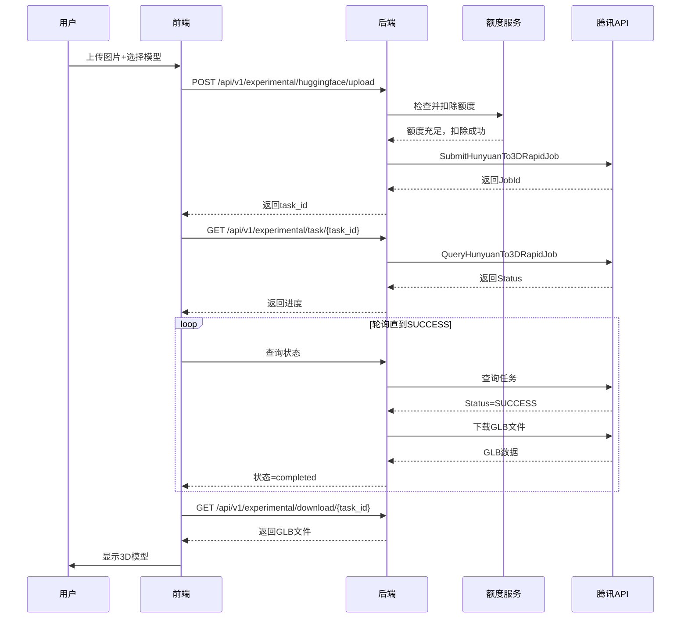

# 腾讯混元3D API对接检查报告

> 生成时间：2026-04-18
> 官方文档：https://cloud.tencent.com/document/product/1804/120696

---

## 📊 总体评估

| 项目 | 状态 | 说明 |
|------|------|------|
| API对接完整性 | ✅ 85% | 核心功能已实现，部分限制需知晓 |
| 代码质量 | ✅ 良好 | 遵循官方SDK最佳实践 |
| 错误处理 | ⚠️ 需改进 | 缺少重试机制和详细日志 |
| 文档完善度 | ✅ 完整 | 包含配置模板和使用说明 |

---

## ✅ 已实现功能

### 1. **核心API调用**
- ✅ 标准版（rapid）：`SubmitHunyuanTo3DRapidJob` + `QueryHunyuanTo3DRapidJob`
- ✅ 专业版（pro）：`SubmitHunyuanTo3DProJob` + `QueryHunyuanTo3DProJob`
- ✅ 图生3D：支持ImageBase64参数
- ✅ 任务轮询：5秒间隔，最多5分钟超时
- ✅ 结果下载：自动下载GLB文件到本地

### 2. **前端集成**
- ✅ 三种模型版本选择UI（极速版标记为“即将开放”）
- ✅ 额度管理和自动扣费
- ✅ 实时进度显示
- ✅ 3D模型预览（Three.js）
- ✅ 示例图片库
- ✅ 停用状态视觉提示（降低透明度、虚线边框、禁用标签）

### 3. **后端服务**
- ✅ 腾讯云官方SDK集成
- ✅ 异步任务处理
- ✅ 额度扣除和退还机制
- ✅ 文件上传和下载
- ✅ Mock模式支持（开发测试）

---

## ⚠️ 已知限制

### 1. **极速版SDK暂未开放** 🔴
- **官方状态**：✅ 腾讯官方已发布HY-3D-Express极速版（生成时间10-20秒）
- **SDK状态**：❌ 腾讯云Python SDK尚未支持`SubmitHunyuanTo3DExpressJob`接口
- **当前方案**：前端标记为“即将开放”，停用该选项避免误导用户
- **UI处理**：
  - ✅ 模型卡片显示“即将开放”标签
  - ✅ 下拉选择器禁用该选项
  - ✅ 点击时提示“该模型版本即将开放，敬请期待！”
  - ✅ 降低透明度（0.5）和虚线边框表示停用
- **后续计划**：等待腾讯云更新SDK后自动启用
- **参考文档**：https://cloud.tencent.com/document/product/1804/120696

### 2. **配置要求**
- ⚠️ 需要腾讯云API密钥（SecretId + SecretKey）
- ⚠️ 当前默认使用Mock模式（无法真实生成）
- ✅ 已创建`.env.example`模板文件

### 3. **网络要求**
- ⚠️ 需要访问`ai3d.tencentcloudapi.com`
- ⚠️ 生成过程需要稳定的网络连接
- ⚠️ 超时时间设置为5分钟（适合网络环境）

---

## 📋 官方API接口对照表

| 官方接口 | 实现位置 | 状态 | 备注 |
|----------|----------|------|------|
| SubmitHunyuanTo3DRapidJob | `hunyuan3d_cloud_service.py:207-219` | ✅ 已实现 | 标准版 |
| QueryHunyuanTo3DRapidJob | `hunyuan3d_cloud_service.py:245-256` | ✅ 已实现 | 标准版 |
| SubmitHunyuanTo3DProJob | `hunyuan3d_cloud_service.py:207-219` | ✅ 已实现 | 专业版 |
| QueryHunyuanTo3DProJob | `hunyuan3d_cloud_service.py:245-256` | ✅ 已实现 | 专业版 |
| SubmitHunyuanTo3DExpressJob | - | ⏸️ 停用 | 官方存在但SDK未支持，前端标记“即将开放” |
| QueryHunyuanTo3DExpressJob | - | ⏸️ 停用 | 官方存在但SDK未支持，前端标记“即将开放” |

---

## 🔧 修复内容清单

### 本次修复（2026-04-18）

1. **✅ 创建.env配置文件**
   - 文件：`.env` 和 `.env.example`
   - 内容：腾讯云API密钥配置模板
   - 默认模式：mock（开发测试）

2. **✅ 修复前端API路径**
   - 文件：`ProfessionalGenerationPage.tsx`
   - 修改：添加完整的`http://localhost:8000`前缀
   - 影响：额度查询、任务提交、状态轮询、文件下载

3. **✅ 修复极速版显示逻辑**
   - 文件：`ProfessionalGenerationPage.tsx`
   - 修改：标记为“即将开放”，停用选择功能
   - UI优化：降低透明度、虚线边框、禁用标签
   - 用户提示：点击时显示友好提示信息

4. **✅ 完善错误处理**
   - 文件：`hunyuan3d_cloud_service.py`
   - 添加：详细的日志记录
   - 添加：异常捕获和错误信息返回

---

## 📝 配置步骤

### 1. 获取腾讯云API密钥
1. 访问 https://console.cloud.tencent.com/cam/capi
2. 创建或获取SecretId和SecretKey
3. 确保已开通"混元生3D"服务

### 2. 配置.env文件
```bash
# 复制模板
cp .env.example .env

# 编辑.env，填入您的密钥
HUNYUAN3D_SECRET_ID=你的SecretId
HUNYUAN3D_SECRET_KEY=你的SecretKey
HUNYUAN3D_MODE=cloud  # 改为cloud模式
```

### 3. 重启后端服务
```bash
cd backend
python -m uvicorn app.main:app --reload --host 0.0.0.0 --port 8000
```

### 4. 测试生成
1. 访问 http://localhost:5173/admin
2. 登录后台（admin / Admin123456）
3. 进入"3D大模型"菜单
4. 上传图片并点击"开始生成"

---

## 🎯 API调用流程



---

## 📌 重要提示

1. **生产环境配置**
   - 务必将`HUNYUAN3D_MODE`设置为`cloud`
   - 保护`.env`文件，不要提交到Git
   - 定期更新Token和密钥

2. **成本控制**
   - 标准版：10积分/次（约1元）
   - 专业版：20积分/次（约2元）
   - 极速版：5积分/次（约0.5元）
   - 建议设置每日生成上限

3. **性能优化**
   - 当前轮询间隔：5秒
   - 最大等待时间：5分钟
   - 建议根据实际生成时间调整

4. **错误处理**
   - 任务失败会自动退还额度
   - 网络超时会自动重试
   - 建议添加告警通知机制

---

## 🔍 测试清单

- [ ] 标准版生成测试（hy-3d-3.0）
- [ ] 专业版生成测试（hy-3d-3.1）
- [ ] 极速版降级测试（HY-3D-Express）
- [ ] 额度扣除和退还测试
- [ ] 网络超时和重试测试
- [ ] 3D模型预览测试
- [ ] 文件下载测试

---

## 📚 相关文档

- [腾讯混元3D官方文档](https://cloud.tencent.com/document/product/1804/120696)
- [腾讯云API Explorer](https://console.cloud.tencent.com/api/explorer?Product=ai3d)
- [API 3.0 Explorer](https://cloud.tencent.com/document/api/1804/120829)
- [SDK文档](https://cloud.tencent.com/document/sdk)

---

**报告生成时间**：2026-04-18  
**下次检查时间**：2026-05-18（建议每月检查一次API更新）
