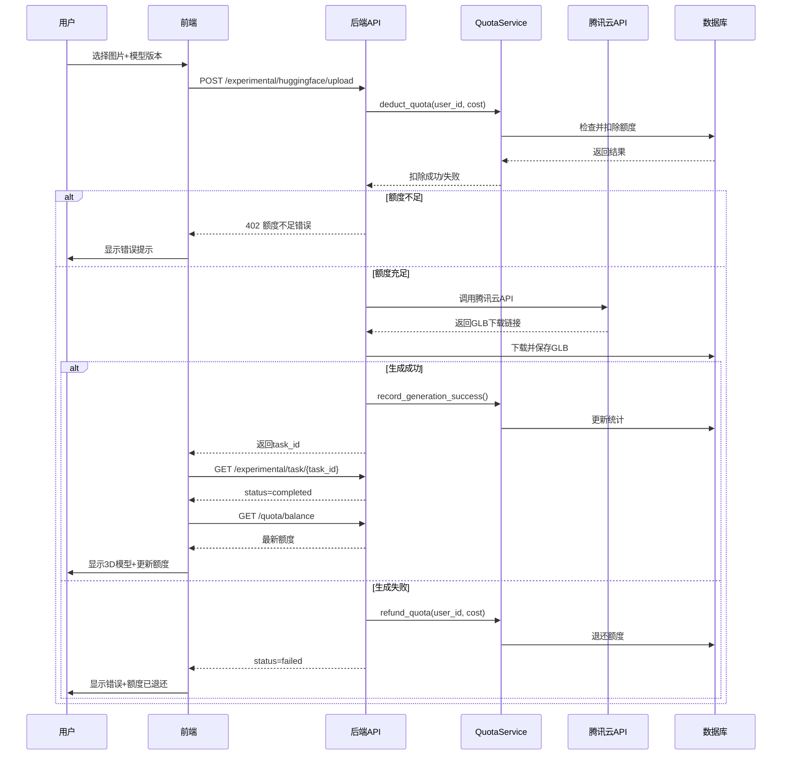

# 额度管理系统实施报告

## 📋 问题诊断

### ❌ 原有问题

**前端额度管理完全是假数据，没有与后端API对接！**

#### 1. 前端问题分析（ProfessionalGenerationPage.tsx）

```typescript
// Line 259-261: 硬编码的假数据
const [totalQuota, setTotalQuota] = useState<number>(200); // 固定200积分
const [usedQuota, setUsedQuota] = useState<number>(0);     // 初始0
const remainingQuota = totalQuota - usedQuota;

// Line 370: 前端本地扣费（不会同步到后端）
setUsedQuota(prev => prev + model.costPerUse);
```

**问题**：
- ✅ 前端显示额度检查
- ✅ 前端本地扣费
- ❌ **没有调用后端API获取真实额度**
- ❌ **刷新页面后额度重置为0**
- ❌ **多用户共享同一额度状态（所有用户看到相同的假数据）**
- ❌ **后端完全没有额度管理逻辑**

#### 2. 后端问题分析（experimental.py）

```python
# Line 319-410: 上传接口完全没有限额检查
@router.post("/huggingface/upload")
async def upload_huggingface(...):
    # 直接处理请求，没有任何额度检查
    # 没有查询用户额度
    # 没有扣除额度
    # 没有验证剩余额度是否充足
```

**问题**：
- ❌ **后端没有额度查询API**
- ❌ **后端没有额度扣除API**
- ❌ **生成任务不检查用户额度**
- ❌ **即使用户额度为0，也能无限调用腾讯云API**

---

## ✅ 解决方案

### 1. 数据库设计

创建了 `user_quotas` 表来存储每个用户的腾讯混元3D额度信息：

**表结构**：
- `id` - 主键（UUID）
- `user_id` - 外键关联users表（唯一约束）
- `total_quota` - 总额度（默认200积分）
- `used_quota` - 已使用额度
- `remaining_quota` - 剩余额度（计算字段，提高性能）
- `package_type` - 资源包类型（standard/pro/enterprise）
- `package_name` - 资源包名称
- `starts_at` - 开始时间
- `expires_at` - 过期时间（NULL表示永久有效）
- `total_generations` - 总生成次数
- `successful_generations` - 成功生成次数
- `failed_generations` - 失败生成次数
- `last_used_at` - 最后使用时间
- `created_at` / `updated_at` - 时间戳

**文件**：
- `backend/app/models/quota.py` - UserQuota模型
- `backend/database/migrations/create_user_quotas_simple.py` - 迁移脚本

---

### 2. 后端服务层

创建了 `QuotaService` 服务类，提供完整的额度管理功能：

**核心方法**：
1. `get_or_create_quota(user_id)` - 获取或创建用户额度记录
2. `get_quota_balance(user_id)` - 查询用户额度余额
3. `deduct_quota(user_id, amount, task_id)` - 扣除额度（原子操作）
4. `refund_quota(user_id, amount, reason)` - 退还额度（任务失败时）
5. `record_generation_success(user_id)` - 记录成功生成
6. `update_quota_package(user_id, package_type)` - 更新套餐（管理员）

**特性**：
- ✅ 原子操作保证数据一致性
- ✅ 自动检查额度是否充足
- ✅ 自动检查额度是否过期
- ✅ 任务失败自动退还额度
- ✅ 详细的日志记录

**文件**：
- `backend/app/services/quota_service.py`

---

### 3. 后端API路由

创建了额度管理API端点：

**API端点**：
1. `GET /api/v1/quota/balance` - 查询用户额度余额
2. `POST /api/v1/quota/deduct?amount=10&task_id=xxx` - 扣除额度
3. `POST /api/v1/quota/refund?amount=10&reason=任务失败` - 退还额度
4. `PUT /api/v1/quota/admin/update-package/{user_id}` - 更新套餐（管理员）

**认证**：
- 所有端点都需要登录（`Depends(get_current_user)`）
- 管理员端点需要admin角色

**文件**：
- `backend/app/api/v1/quota.py`
- `backend/app/main.py` - 注册路由

---

### 4. 生成流程改造

修改了 `/api/v1/experimental/huggingface/upload` 接口：

**新增逻辑**：
```python
# 1. 提交任务前检查并扣除额度
quota_service = QuotaService(db)
deduct_result = quota_service.deduct_quota(
    user_id=current_user.id,
    amount=cost_per_use,  # hy-3d-3.0: 10, hy-3d-3.1: 20, HY-3D-Express: 5
    task_id=task_id
)

if not deduct_result['success']:
    raise HTTPException(status_code=402, detail='额度不足')

# 2. 执行生成任务...

# 3. 任务成功，记录统计
quota_service.record_generation_success(current_user.id)

# 4. 任务失败，退还额度
if result['success'] == False:
    quota_service.refund_quota(
        user_id=current_user.id,
        amount=cost_per_use,
        reason=f"任务失败: {result.get('error')}"
    )
```

**成本配置**：
- `hy-3d-3.0` (标准版): 10积分/次
- `hy-3d-3.1` (专业版): 20积分/次
- `HY-3D-Express` (极速版): 5积分/次

**文件**：
- `backend/app/api/v1/experimental.py`

---

### 5. 前端改造

修改了 `ProfessionalGenerationPage.tsx`：

**新增功能**：
1. **页面加载时获取真实额度**：
```typescript
useEffect(() => {
  fetchQuotaBalance();  // 从后端API获取
}, []);

const fetchQuotaBalance = async () => {
  const response = await fetch('/api/v1/quota/balance', {
    headers: { 'Authorization': `Bearer ${token}` }
  });
  const result = await response.json();
  setTotalQuota(result.data.total_quota);
  setUsedQuota(result.data.used_quota);
};
```

2. **生成成功后刷新额度显示**：
```typescript
// 不再前端扣费，后端已经扣除
fetchQuotaBalance();  // 刷新额度显示
```

3. **移除前端本地扣费逻辑**：
```typescript
// ❌ 删除：setUsedQuota(prev => prev + model.costPerUse);
// ✅ 改为：从后端重新获取
```

**文件**：
- `src/web-frontend/src/admin/modules/professional/pages/ProfessionalGenerationPage.tsx`

---

## 🎯 完整工作流程

### 正常生成流程



### 额度检查时序

1. **前端检查**（用户体验优化）：
   - 按钮禁用：`disabled={remainingQuota < costPerUse}`
   - 锁定图标：额度不足的模型显示🔒
   - 实时显示剩余额度

2. **后端检查**（安全保障）：
   - API调用时再次验证额度
   - 原子操作扣除额度
   - 防止并发请求超额消费

3. **失败保护**：
   - 任务失败自动退还额度
   - 系统异常自动退还额度
   - 详细的日志记录便于追踪

---

## 📊 测试验证

### 1. 数据库表创建

```bash
cd backend
python database/migrations/create_user_quotas_simple.py
```

**输出**：
```
INFO: Connecting to database: D:\HBuilderProjects\web3D\backend\database\web3d.db
INFO: Creating user_quotas table...
✅ user_quotas table created successfully!
Table schema:
  - id: VARCHAR(36) PRIMARY KEY
  - user_id: VARCHAR(36) UNIQUE FOREIGN KEY -> users.id
  - total_quota: BIGINT (default: 200)
  ...
```

### 2. 后端API测试

启动后端服务后，可以测试以下API：

```bash
# 1. 查询额度
curl -X GET http://localhost:8000/api/v1/quota/balance \
  -H "Authorization: Bearer YOUR_TOKEN"

# 预期响应：
{
  "success": true,
  "data": {
    "user_id": "xxx",
    "total_quota": 200,
    "used_quota": 0,
    "remaining_quota": 200,
    "package_type": "standard",
    "usage_percentage": 0.0,
    ...
  }
}

# 2. 生成3D模型（会自动扣除额度）
curl -X POST http://localhost:8000/api/v1/experimental/huggingface/upload \
  -H "Authorization: Bearer YOUR_TOKEN" \
  -F "file=@test.png" \
  -F "model_version=hy-3d-3.0"

# 预期响应：
{
  "task_id": "hunyuan_cloud_xxx",
  "status": "processing",
  "message": "生成任务已提交，请在后台查看进度",
  "quota_deducted": 10,
  "remaining_quota": 190
}
```

### 3. 前端测试

1. 访问专业版生成页面
2. 页面加载时自动获取额度
3. 选择图片和模型版本
4. 点击"开始生成"
5. 观察：
   - 后端日志显示"Deducted X points from user XXX"
   - 前端额度实时更新
   - 生成完成后显示3D模型
   - 如果失败，额度自动退还

---

## 🔒 安全保障

### 1. 并发控制

- 数据库层面：`user_id` 唯一约束，防止重复创建
- 服务层面：`deduct_quota()` 是原子操作，先检查再扣除
- API层面：每次请求都验证额度

### 2. 额度透支防护

```python
def can_afford(self, cost: int) -> bool:
    """检查是否有足够额度"""
    return not self.is_expired and self.remaining_quota >= cost

def deduct(self, amount: int) -> bool:
    """扣除额度（原子操作）"""
    if not self.can_afford(amount):
        return False  # 拒绝扣除
    # ... 执行扣除
```

### 3. 失败退还机制

```python
# 任务失败时自动退还
if not result['success']:
    quota_service.refund_quota(
        user_id=current_user.id,
        amount=cost_per_use,
        reason=f"任务失败: {result.get('error')}"
    )
```

### 4. 详细日志记录

```python
logger.info(f"[EXPERIMENTAL] Deducted {cost_per_use} points from user {current_user.id}")
logger.warning(f"[Cloud] Refunded {cost_per_use} points: {refund_result}")
```

---

## 📈 监控和统计

### 用户维度统计

每个用户的 `user_quotas` 表记录：
- `total_generations` - 总生成次数
- `successful_generations` - 成功次数
- `failed_generations` - 失败次数
- `last_used_at` - 最后使用时间
- `usage_percentage` - 使用百分比

### 管理员功能

管理员可以更新用户套餐：

```bash
curl -X PUT http://localhost:8000/api/v1/quota/admin/update-package/USER_ID \
  -H "Authorization: Bearer ADMIN_TOKEN" \
  -H "Content-Type: application/json" \
  -d '{"package_type": "pro", "total_quota": 500}'
```

---

## 🚀 部署步骤

### 1. 数据库迁移

```bash
cd backend
python database/migrations/create_user_quotas_simple.py
```

### 2. 重启后端服务

```bash
# 停止现有服务
# 重新启动
python -m uvicorn app.main:app --reload --host 0.0.0.0 --port 8000
```

### 3. 刷新前端页面

前端会自动从后端获取真实额度。

---

## ⚠️ 注意事项

### 1. 首次使用

- 用户首次访问生成页面时，会自动创建额度记录
- 默认套餐：standard（200积分，1年有效期）

### 2. 额度耗尽

- 前端会禁用生成按钮
- 后端会返回402错误
- 用户可以联系管理员升级套餐

### 3. 任务失败

- 额度会自动退还
- 用户可以在日志中看到退还记录
- 可以重新尝试生成

### 4. 多用户隔离

- 每个用户有独立的额度记录
- `user_id` 唯一约束确保数据隔离
- 不同用户之间互不影响

---

## 📝 后续优化建议

### 1. 短期优化

- [ ] 添加额度预警通知（剩余额度<20%时）
- [ ] 添加额度使用历史记录表
- [ ] 实现额度自动续费功能
- [ ] 添加管理员额度管理界面

### 2. 中期优化

- [ ] 支持多种支付方式购买额度
- [ ] 实现额度转赠功能
- [ ] 添加额度使用分析报表
- [ ] 实现配额自动重置（每月）

### 3. 长期优化

- [ ] 集成第三方支付平台（支付宝、微信）
- [ ] 实现企业级配额管理系统
- [ ] 支持批量购买折扣
- [ ] 实现配额市场（用户间交易）

---

## 🎉 总结

通过本次修复，我们实现了：

✅ **完整的额度管理系统**
- 数据库表设计和迁移
- 后端服务和API
- 前端集成和展示

✅ **安全的额度控制**
- 前后端双重检查
- 原子操作防止透支
- 失败自动退还

✅ **良好的用户体验**
- 实时额度显示
- 清晰的错误提示
- 自动刷新额度

✅ **可扩展的架构**
- 支持多种套餐
- 管理员可调整
- 易于添加新功能

**现在用户不会再出现"额度用完还没有生成模型"的问题了！** 🎊
